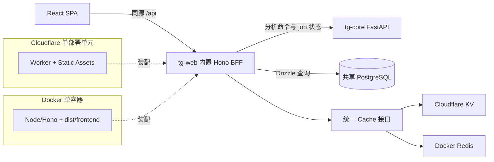

# tg-web 全栈脚手架设计

> 日期：2026-07-14  
> 状态：设计已确认，等待书面规格审阅  
> 新项目目录：`tg-web/`，与 `tg-core/` 并列

## 1. 背景

当前仓库只有 Python 子项目 `tg-core/`。Core 通过 FastAPI 提供异步分析 job API，
并使用 PostgreSQL 保存 job、模型价格和价格源刷新状态。

本设计新增 TypeScript 子项目 `tg-web/`。它是面向 C 端用户的 Web 应用脚手架，
但首期只建立可运行、可部署、可测试的架构，不开发登录、分析、报告、用户管理、
支付或其他具体业务功能。未来管理员仍是普通 C 端用户的一种角色，而不是独立账号体系。

`tg-web` 的 React 前端与服务前端的 Hono BFF 属于同一个项目和部署单元。
BFF 不是独立 API 产品，也不单独部署。`tg-core` 仍是独立服务，分析 job 通过其 API 操作。

## 2. 目标

1. 建立 React、TypeScript 和 Hono 的单包全栈项目。
2. 使用同一套应用代码支持 Cloudflare Workers 和 Docker/Node 两种运行时。
3. Cloudflare 使用 KV 缓存与 Hyperdrive PostgreSQL；Docker 使用 Redis 与普通 PostgreSQL 连接池。
4. React 通过同源 `/api` 调用内置 BFF，前后端共享 TypeScript API 类型和 Zod 契约。
5. 使用 Drizzle 完整映射 Core 已有的三张 PostgreSQL 表。
6. 保持分析 job 的命令与状态变更由 Core API 负责，同时允许 BFF 直接查询 PostgreSQL。
7. 提供配置校验、统一错误、结构化日志、健康检查、测试和部署骨架。

## 3. 非目标

- 不实现用户、会话、角色或权限表。
- 不实现登录、注册、管理员、分析、报告、收藏、余额、充值、支付或通知功能。
- 不为未实现的业务创建占位路由、占位表或空 Repository。
- 不把浏览器直接连接到 PostgreSQL、Redis、KV 或 Core API。
- 不重写 `tg-core` 的 job 执行、状态迁移、队列或 advisory lock。
- 不让 Drizzle migration 创建或修改 Core 拥有的三张表。
- 不部署 Cloudflare 资源，也不写入真实密钥。
- 不引入 SSR；本项目是应用型 React SPA。

## 4. 技术方案选择

采用 Vite React + React Router + Hono 的单包方案。

未选择 React Router Framework Mode，因为本项目不需要 SSR，loader/action 的收益不足以抵消
双运行时适配复杂度。未选择 Next.js + OpenNext，因为它对当前脚手架过重，并会增加
Cloudflare 构建和缓存语义的复杂度。

前端基础：

- React、Vite、React Router
- TanStack Query
- Hono RPC client
- Zod
- Tailwind CSS、shadcn/ui 约定、Lucide 图标

服务端基础：

- Hono
- Drizzle ORM
- `pg`（Drizzle `node-postgres` driver）
- Redis client
- Cloudflare Workers Static Assets、KV、Hyperdrive

工程工具：

- pnpm
- TypeScript strict mode
- ESLint、Prettier
- Vitest、React Testing Library、Playwright

## 5. 总体架构



`tg-web` 内部的 Hono BFF 与 React 一起构建和部署。只有 `tg-core` 是外部 API 服务。

## 6. 目录结构

```text
tg-web/
├── src/
│   ├── frontend/
│   │   ├── app/                 # Router、QueryClient、应用外壳
│   │   ├── pages/               # 首期仅基础首页和 404
│   │   ├── components/          # 首期所需的最小 UI 基础
│   │   └── lib/                 # 类型化同源 BFF client
│   ├── backend/
│   │   ├── app.ts               # 与运行时无关的 Hono app 工厂
│   │   ├── routes/              # health 与 readiness
│   │   ├── core/                # tg-core API client
│   │   ├── database/            # Drizzle client、schema、查询边界
│   │   ├── cache/               # Cache 契约及适配器
│   │   ├── config/              # 配置模型与校验
│   │   ├── errors/              # 统一错误模型与映射
│   │   └── logging/             # 请求 ID 与结构化日志
│   ├── runtimes/
│   │   ├── node.ts              # Docker/Node 入口与静态文件服务
│   │   └── cloudflare.ts        # Worker 入口与 bindings 装配
│   └── shared/                  # Zod 契约、API 类型、公共常量
├── tests/
│   ├── unit/
│   ├── integration/
│   └── e2e/
├── Dockerfile
├── compose.yaml
├── wrangler.jsonc
├── drizzle.config.ts
├── vite.config.ts
├── tsconfig.json
└── package.json
```

`backend/app.ts` 只接收依赖并构造 Hono app，不直接读取 `process.env`、KV、Redis 或
Cloudflare bindings。两个 runtime 入口只组装依赖，不包含业务规则。

开发环境允许一个 `pnpm dev` 同时运行 Vite 与 Node/Hono 两个开发进程，并由 Vite 将
`/api` 代理到 Hono。生产环境始终是一个部署单元和一个对外服务端点。

## 7. 应用与路由边界

首期只提供：

- React 基础应用外壳和 404 页面。
- `GET /api/health`：只证明应用进程或 Worker 可以响应。
- `GET /api/ready`：检查 PostgreSQL、缓存 binding/连接和 Core 可达性。

`/api/*` 必须先于静态资源和 SPA fallback 匹配。未知 API 返回 JSON 404；只有非 API
路径才回退到 React `index.html`。这样 API 拼写错误不会被错误地返回 HTML 200。

Hono app 导出稳定的 `AppType`。React 通过 Hono RPC client 使用该类型，且只进行
`import type`，防止服务端实现或 Secret 被打入浏览器 bundle。共享请求与响应模型放在
`src/shared/` 并由 Zod 执行运行时校验。

## 8. Core API 边界

未来分析功能必须通过 `src/backend/core/` 调用现有 Core API：

- `POST /api/v1/analyses`
- `GET /api/v1/analyses`
- `GET /api/v1/analyses/{job_id}`
- `GET /api/v1/analyses/{job_id}/events`
- `GET /health`

`CORE_API_KEY` 只存在于服务端运行时。浏览器不直接调用 Core，也不会获得该 Token。
Core client 负责请求超时、Bearer Token、响应校验和错误映射，但不复制 Core 的 job
状态机或分析业务逻辑。

## 9. PostgreSQL 与 Drizzle

两端统一使用 `pg` 与 Drizzle `node-postgres` driver，避免维护两套 SQL driver 语义。
Cloudflare runtime 在 Wrangler 开启 `nodejs_compat`，使用 Hyperdrive 提供的连接信息建立
Drizzle client；Docker runtime 使用普通 `pg.Pool`。上层数据库访问代码不感知连接来源。

### 9.1 `analysis_jobs`

Drizzle 映射必须与 Core 当前 schema 一致：

| 字段 | PostgreSQL 类型 | 约束或默认值 |
|---|---|---|
| `id` | UUID | Primary Key |
| `request_id` | UUID | 可空，非空时唯一 |
| `ticker` | TEXT | 非空 |
| `trade_date` | DATE | 非空 |
| `asset_type` | TEXT | 非空 |
| `analysts` | JSONB | 非空 |
| `status` | TEXT | 非空，`queued/running/succeeded/failed` |
| `request` | JSONB | 非空 |
| `config` | JSONB | 非空，默认 `{}` |
| `final_state` | JSONB | 可空 |
| `decision` | TEXT | 可空 |
| `error` | TEXT | 可空 |
| `report_path` | TEXT | 可空 |
| `tokens_used` | INTEGER | 非空，默认 `0` |
| `token_usage` | JSONB | 非空，默认 `{}` |
| `cost_usd` | NUMERIC(18, 8) | 非空，默认 `0` |
| `cost_breakdown` | JSONB | 非空，默认 `{}` |
| `progress_percent` | INTEGER | 非空，默认 `0` |
| `current_step` | TEXT | 可空 |
| `events` | JSONB | 非空，默认 `[]` |
| `created_at` | TIMESTAMPTZ | 非空，默认 `now()` |
| `updated_at` | TIMESTAMPTZ | 非空，默认 `now()` |
| `started_at` | TIMESTAMPTZ | 可空 |
| `finished_at` | TIMESTAMPTZ | 可空 |

同时映射现有索引：

- `analysis_jobs_request_id_key`：`request_id IS NOT NULL` 的唯一索引。
- `analysis_jobs_ticker_created_idx`：`ticker, created_at DESC`。
- `analysis_jobs_status_created_idx`：`status, created_at DESC`。

### 9.2 `llm_model_prices`

| 字段 | PostgreSQL 类型 | 约束或默认值 |
|---|---|---|
| `provider` | TEXT | 复合主键 |
| `model` | TEXT | 复合主键 |
| `billing_mode` | TEXT | 复合主键，默认 `standard` |
| `context_tier` | TEXT | 复合主键，默认 `short` |
| `currency` | TEXT | 非空，默认 `USD` |
| `unit_tokens` | INTEGER | 非空，默认 `1000000` |
| `input_price` | NUMERIC(18, 8) | 非空 |
| `cached_input_price` | NUMERIC(18, 8) | 可空 |
| `cache_write_price` | NUMERIC(18, 8) | 可空 |
| `output_price` | NUMERIC(18, 8) | 非空 |
| `source_url` | TEXT | 非空 |
| `created_at` | TIMESTAMPTZ | 非空，默认 `now()` |
| `updated_at` | TIMESTAMPTZ | 非空，默认 `now()` |

### 9.3 `llm_pricing_sources`

| 字段 | PostgreSQL 类型 | 约束或默认值 |
|---|---|---|
| `source_url` | TEXT | Primary Key |
| `update_interval_seconds` | INTEGER | 非空，默认 `3600` |
| `last_checked_at` | TIMESTAMPTZ | 可空 |
| `last_success_at` | TIMESTAMPTZ | 可空 |
| `last_error` | TEXT | 可空 |
| `model_count` | INTEGER | 非空，默认 `0` |
| `updated_at` | TIMESTAMPTZ | 非空，默认 `now()` |

### 9.4 表级访问规则

| 表 | BFF 访问规则 |
|---|---|
| `analysis_jobs` | 可以直接查询；创建、claim、进度、事件、成功和失败等状态写入必须走 Core API |
| `llm_model_prices` | 可以直接查询；未来管理员服务可以新增、修改和删除 |
| `llm_pricing_sources` | 以查询为主；刷新结果和运行状态由 Core 写入 |

Drizzle schema 本身完整描述三张表，不在类型层伪装成只读。访问限制由数据访问模块暴露的
函数和未来授权服务执行。

Core 当前每小时自动 upsert `llm_model_prices`。未来实现人工价格维护时，必须单独设计
自动价格与人工覆盖的优先级；当前 schema 下直接修改同一个复合主键记录可能被 Core
下次刷新覆盖。本脚手架不虚构一个尚不存在的持久覆盖机制。

### 9.5 Migration 所有权

三张表由 Core 初始化，因此 `tg-web` 首期不生成用于创建或修改这些表的 migration。
Drizzle schema 用于类型化访问和 schema 一致性检查。以后新增 Web 自有表时，才由
`tg-web` 的 Drizzle migration 管理，并在迁移中明确表所有权。

## 10. 缓存抽象

定义最小 Cache 契约：

- `get(key)`
- `set(key, value, ttlSeconds)`
- `delete(key)`

Cloudflare 由 KV adapter 实现，Docker 由 Redis adapter 实现。首期不设计业务缓存键、
tag invalidation、分布式锁、队列或 rate limit。缓存值使用显式序列化，不保存 Secret。

缓存永远不是事实来源。KV 的最终一致性和 Redis 的一致性差异不得改变 PostgreSQL 数据、
job 状态或权限判断。普通缓存读取失败时记录告警并绕过缓存；未来如果缓存承担安全职责，
必须为该职责定义独立的 fail-open/fail-closed 策略。

## 11. 配置

公共服务端配置：

- `CORE_API_URL`
- `LOG_LEVEL`
- 运行环境标识

服务端 Secret：

- `CORE_API_KEY`

Cloudflare bindings：

- `HYPERDRIVE`
- `CACHE_KV`
- `ASSETS`

Docker 环境变量：

- `DATABASE_URL`
- `REDIS_URL`
- `PORT`

配置在 runtime 入口处通过 Zod 显式校验。缺失必需配置时启动或请求初始化失败，不静默使用
本地地址，不自动切换到另一种基础设施，也不把凭据放入 `VITE_*` 变量。

## 12. 错误处理、健康检查与日志

统一错误响应：

```json
{
  "error": {
    "code": "CORE_UNAVAILABLE",
    "message": "Analysis service is temporarily unavailable",
    "requestId": "request-id"
  }
}
```

规则：

- 每个请求生成或透传 request ID，并在日志和错误响应中保持一致。
- 参数校验失败返回 `400`；未来认证使用 `401/403`；资源不存在返回 `404`。
- Core 错误映射为 `502/503/504`，不向浏览器暴露原始错误体、Token 或内部 URL。
- PostgreSQL 不可用返回 `503`。
- Cache 故障记录结构化告警并按非权威缓存语义绕过。
- `/api/health` 不访问外部依赖。
- `/api/ready` 检查 PostgreSQL 与 Core；Redis 使用 `PING`，KV 至少验证 binding 和受控读取。
- PostgreSQL 或 Core 不可用时 readiness 返回 `503`；缓存不可用时可以返回 `200`，但状态为 `degraded`。
- 日志自动屏蔽 Core Token、数据库 URL、Redis URL、Authorization 和 Cookie。

## 13. 构建与部署

### 13.1 Docker

多阶段 Dockerfile：

1. 安装锁定的 pnpm 依赖。
2. Vite 构建 React 到 `dist/frontend`。
3. 构建 Node/Hono 到 `dist/backend`。
4. 最终镜像只保留生产依赖和构建产物。
5. 使用非 root 用户运行一个 Node 进程。

Node/Hono 先处理 `/api`，再提供 `dist/frontend` 静态资源，最后对非 API 路径返回
`index.html`。容器只暴露一个端口。

`compose.yaml` 启动一个 `tg-web` 应用容器和一个 Redis 基础设施容器。前端与 BFF 都在
`tg-web` 容器内，不存在第二个前端或 API 容器。PostgreSQL 与 Core API 是外部依赖，
必须通过 `DATABASE_URL` 和 `CORE_API_URL` 提供从该容器可路由的地址。部署者可以让它
加入现有 Core Compose 网络，或使用平台提供的内部地址；不能在容器内把 `localhost`
误当成 Core/PostgreSQL。该 compose 不复制 Core 或 PostgreSQL，因此 `tg-web` 与
`tg-core` 使用的是同一个数据库。

### 13.2 Cloudflare

`wrangler.jsonc` 声明 Static Assets、KV 和 Hyperdrive bindings。Worker 对 `/api` 使用
Hono app，对其他路径使用 Assets binding，并为 SPA 深链回退到 `index.html`。

Cloudflare Secret 通过 Wrangler Secret 或部署平台注入。仓库只提供示例变量名和本地配置，
不包含账户 ID、数据库凭据、Token 或真实 binding ID。首期不执行真实部署。

## 14. 测试策略

### 14.1 单元测试

- Zod 配置校验，包括缺失和非法值。
- 统一错误映射与 Secret 脱敏。
- Core API client 的 URL、Bearer Token、超时和响应校验。
- 三张 Drizzle 表的列、主键、索引和 TypeScript 类型。
- Cache 契约，包括 TTL、miss、delete 和 adapter 错误。

### 14.2 应用测试

- 使用 Hono `app.request()` 和假依赖测试 health、ready、JSON 404 和错误响应。
- 验证 `/api/*` 永远不会回退到 React HTML。
- 验证前端 client 只使用同源 `/api`。

### 14.3 集成测试

- 使用临时 PostgreSQL 验证 Drizzle 能查询与 Core schema 一致的三张表。
- 使用 Redis 验证 Docker cache adapter。
- 使用 Cloudflare Worker 测试环境验证 KV adapter 和 bindings 装配。
- Core API 使用受控 stub，不依赖真实 LLM 或外部金融数据。

### 14.4 端到端与部署验证

- Playwright 验证基础首页、404、SPA 深链和 API 404。
- 构建 Docker 镜像并启动，验证同一端口同时提供 React 与 `/api/health`。
- 使用本地 Wrangler 验证 Worker、Static Assets 与 `/api/health`。
- 在桌面和移动 viewport 检查基础应用外壳无溢出和遮挡。

持续验证命令：

```bash
pnpm lint
pnpm typecheck
pnpm test
pnpm build
```

## 15. 验收标准

1. `tg-web/` 是独立单包 TypeScript 项目，与 `tg-core/` 并列。
2. 一个开发命令可以启动 React 与内置 Hono BFF。
3. 一个生产 Docker 容器和一个端口同时提供 React SPA 与 `/api`。
4. 同一 Hono app 可以由 Node runtime 和 Cloudflare Worker runtime 装配。
5. Cloudflare 使用 KV + Hyperdrive，Docker 使用 Redis + PostgreSQL Pool。
6. React 通过同源、类型化 client 调用 BFF，任何服务端 Secret 都不进入浏览器 bundle。
7. 三张 Core 表有与现有 PostgreSQL schema 一致的完整 Drizzle 定义。
8. `analysis_jobs` 状态写入仍通过 Core API；价格表与价格源表遵守已确认的访问规则。
9. Core 拥有的三张表不会被 `tg-web` migration 创建或修改。
10. health、ready、统一错误、结构化日志和 Secret 脱敏具有自动化测试。
11. lint、typecheck、test、build、Docker smoke 和本地 Worker smoke 均通过。
12. 首期不包含未请求的业务功能、业务表或真实云资源变更。
