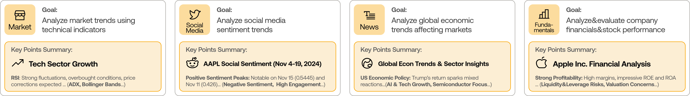
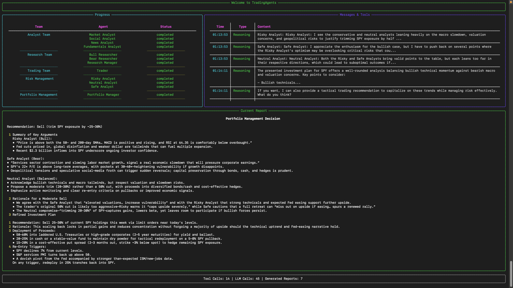

<p align="center">
  
</p>

<div align="center" style="line-height: 1;">
  <a href="https://arxiv.org/abs/2412.20138" target="_blank"></a>
  <a href="https://discord.com/invite/hk9PGKShPK" target="_blank"></a>
  <a href="./assets/wechat.png" target="_blank"></a>
  <a href="https://x.com/TauricResearch" target="_blank"></a>
  <br>
  <a href="https://github.com/TauricResearch/" target="_blank"></a>
</div>

<div align="center">
  <!-- 请保留这些链接；翻译版本会随 README 自动更新。 -->
  <a href="https://www.readme-i18n.com/TauricResearch/TradingAgents?lang=de">Deutsch</a> | 
  <a href="https://www.readme-i18n.com/TauricResearch/TradingAgents?lang=es">Español</a> | 
  <a href="https://www.readme-i18n.com/TauricResearch/TradingAgents?lang=fr">français</a> | 
  <a href="https://www.readme-i18n.com/TauricResearch/TradingAgents?lang=ja">日本語</a> | 
  <a href="https://www.readme-i18n.com/TauricResearch/TradingAgents?lang=ko">한국어</a> | 
  <a href="https://www.readme-i18n.com/TauricResearch/TradingAgents?lang=pt">Português</a> | 
  <a href="https://www.readme-i18n.com/TauricResearch/TradingAgents?lang=ru">Русский</a> | 
  <a href="https://www.readme-i18n.com/TauricResearch/TradingAgents?lang=zh">中文</a>
</div>

---

# TradingAgents：多智能体大语言模型金融投研框架

## 最新动态
- [2026-07] **TradingAgents v0.3.1** 发布，包含正确性与稳定性修复：Alpha Vantage 前视偏差过滤、图路由崩溃安全、按图结构恢复 checkpoint、可用的加密货币情绪数据源、可配置的大语言模型重试预算、Bedrock API Key 鉴权，以及 Claude Sonnet 5 / Fable 5 支持。完整内容见 [CHANGELOG.md](CHANGELOG.md)。
- [2026-06] **TradingAgents v0.3.0** 发布，包含经验证的数据访问契约、扩展的 Provider 注册表（NVIDIA、Kimi、Groq、Mistral、Bedrock 及任意 OpenAI 兼容端点）、FRED 和 Polymarket 数据供应商、新一代模型目录与 CI 门禁。
- [2026-05] **TradingAgents v0.2.5** 发布，包含有事实依据的情绪分析师、GPT-5.5 等模型支持、Qwen/GLM/MiniMax 双区域支持、可通过 `TRADINGAGENTS_*` 环境变量配置并自动检测 API Key、远程 Ollama、非美国市场 Alpha 基准，以及股票代码路径遍历防护。
- [2026-04] **TradingAgents v0.2.4** 发布，包含结构化输出智能体（研究经理、交易员、投资组合经理）、LangGraph checkpoint 恢复、持久化决策日志、DeepSeek/Qwen/GLM/Azure Provider 支持、Docker 与 Windows UTF-8 编码修复。
- [2026-03] **TradingAgents v0.2.3** 发布，包含多语言支持、GPT-5.4 系列模型、统一模型目录、回测日期一致性与代理支持。
- [2026-03] **TradingAgents v0.2.2** 发布，包含 GPT-5.4/Gemini 3.1/Claude 4.6 模型支持、五档评级、OpenAI Responses API、Anthropic 推理强度控制与跨平台稳定性改进。
- [2026-02] **TradingAgents v0.2.0** 发布，包含多 Provider 大语言模型支持（GPT-5.x、Gemini 3.x、Claude 4.x、Grok 4.x）与系统架构改进。
- [2026-01] **Trading-R1** [技术报告](https://arxiv.org/abs/2509.11420)已发布，[Terminal](https://github.com/TauricResearch/Trading-R1) 即将推出。

<div align="center">
<a href="https://www.star-history.com/#TauricResearch/TradingAgents&Date">
 <picture>
   <source media="(prefers-color-scheme: dark)" srcset="https://api.star-history.com/svg?repos=TauricResearch/TradingAgents&type=Date&theme=dark" />
   <source media="(prefers-color-scheme: light)" srcset="https://api.star-history.com/svg?repos=TauricResearch/TradingAgents&type=Date" />
   
 </picture>
</a>
</div>

> 🎉 **TradingAgents** 正式发布！我们收到了许多关于这项工作的咨询，感谢社区的热情支持。
>
> 因此我们决定将框架完全开源，期待与你一起构建有影响力的项目。

<div align="center">

🚀 [TradingAgents](#tradingagents多智能体大语言模型金融投研框架) | ⚡ [安装与 CLI](#安装与-cli) | 🔌 [HTTP API](#http-api) | 🎬 [演示](https://www.youtube.com/watch?v=90gr5lwjIho) | 📦 [Python 包用法](#tradingagents-python-包) | [架构指南（中文）](docs/PROJECT_ARCHITECTURE.md) | 🤝 [参与贡献](#参与贡献) | 📄 [引用](#引用)

</div>

## TradingAgents 框架

TradingAgents 是一个多智能体金融投研框架，模拟真实投研团队的协作方式。系统部署由大语言模型驱动的专业角色，包括基本面、情绪和技术分析师，以及交易员与风险管理团队；它们共同评估市场状况并形成投研决策，同时通过动态讨论确定更优策略。

<p align="center">
  
</p>

> TradingAgents 框架仅用于研究。研究结果可能受所选基础语言模型、模型温度、分析期间、数据质量及其他非确定性因素影响。[它不构成金融、投资或交易建议。](https://tauric.ai/disclaimer/)

框架将复杂的投研任务拆分为专业角色。

### 分析师团队
- 基本面分析师：评估公司财务数据与经营指标，识别内在价值和潜在风险信号。
- 情绪分析师：汇总新闻标题、StockTwits 与 Reddit 讨论，判断短期市场情绪。
- 新闻分析师：跟踪全球新闻和宏观经济指标，解读事件对市场状况的影响。
- 技术分析师：使用 MACD、RSI 等技术指标识别市场形态并预测价格走势。

<p align="center">
  
</p>

### 研究团队
- 由看多与看空研究员组成，审视分析师团队提供的洞见，并通过结构化辩论平衡潜在收益与内在风险。

<p align="center">
  
</p>

### 交易员智能体
- 汇总分析师和研究员的报告，形成投研决策与建议的执行时点、仓位规模。

<p align="center">
  
</p>

### 风险管理与投资组合经理
- 持续评估市场波动率、流动性和其他风险因素。风险管理团队评估并调整策略，将评估报告交给投资组合经理作最终决策。
- 投资组合经理批准或否决研究建议。当前项目输出研究决策，不包含订单提交、模拟交易所或交易执行功能。

<p align="center">
  
</p>

## 安装与 CLI

### 安装

克隆 TradingAgents：
```bash
git clone https://github.com/TauricResearch/TradingAgents.git
cd TradingAgents
```

创建并激活 Python 3.10+ 虚拟环境（推荐 Python 3.12）：
```bash
python3.12 -m venv .venv
source .venv/bin/activate
```

安装软件包及其依赖：
```bash
python -m pip install --upgrade pip
python -m pip install .
```

### Docker

也可以通过 Docker 运行：
```bash
cp .env.example .env  # 填入 API Key
docker compose run --rm tradingagents
```

使用 Ollama 本地模型：
```bash
docker compose --profile ollama run --rm tradingagents-ollama
```

### 所需 API

TradingAgents 支持多个大语言模型 Provider。请为所选 Provider 配置 API Key：

```bash
export OPENAI_API_KEY=...          # OpenAI（GPT）
export GOOGLE_API_KEY=...          # Google（Gemini）
export ANTHROPIC_API_KEY=...       # Anthropic（Claude）
export XAI_API_KEY=...             # xAI (Grok)
export DEEPSEEK_API_KEY=...        # DeepSeek
export DASHSCOPE_API_KEY=...       # Qwen：国际版（dashscope-intl.aliyuncs.com）
export DASHSCOPE_CN_API_KEY=...    # Qwen：中国版（dashscope.aliyuncs.com）
export ZHIPU_API_KEY=...           # GLM via Z.AI（国际版）
export ZHIPU_CN_API_KEY=...        # GLM via BigModel（中国版，open.bigmodel.cn）
export MINIMAX_API_KEY=...         # MiniMax：国际版（api.minimax.io）
export MINIMAX_CN_API_KEY=...      # MiniMax：中国版（api.minimaxi.com）
export OPENROUTER_API_KEY=...      # OpenRouter
export ALPHA_VANTAGE_API_KEY=...   # Alpha Vantage
# TradingView Data API 使用 RapidAPI 时设置 TRADINGVIEW_RAPIDAPI_KEY。
```

对于 TradingView，`TRADINGVIEW_RAPIDAPI_KEY` 的优先级高于通用的
`RAPIDAPI_KEY`。两者均可在进程环境变量或 `.env` 中设置。当其他已配置的
供应商能提供所需能力时，该 Key 是可选的：未配置的 TradingView 适配器会继续尝试该能力链中的下一供应商。

对于 Azure OpenAI，将 `.env.enterprise.example` 复制为 `.env.enterprise` 并填写凭证。

对于 AWS Bedrock，使用 `pip install ".[bedrock]"` 安装额外依赖，设置 `llm_provider: "bedrock"`，配置 AWS 凭证（环境变量、`~/.aws/credentials` 或 IAM 角色）及 `AWS_DEFAULT_REGION`，并使用 Bedrock 模型 ID，例如 `us.anthropic.claude-opus-4-8-v1:0`。

对于本地模型，将 `llm_provider` 配置为 `"ollama"`。默认端点为 `http://localhost:11434/v1`；通过 `OLLAMA_BASE_URL` 指向远程 `ollama-serve`。使用 `ollama pull <name>` 拉取模型；对于默认列表外的模型，请在 CLI 中选择“自定义模型 ID”。

对于其他 OpenAI 兼容服务（vLLM、LM Studio、llama.cpp 或自定义中继），使用 `llm_provider: "openai_compatible"` 并通过 `backend_url`（或 `TRADINGAGENTS_LLM_BACKEND_URL`）设置端点，例如 vLLM 使用 `http://localhost:8000/v1`，LM Studio 使用 `http://localhost:1234/v1`。模型由你的服务端提供；本地服务无需 Key，如端点要求鉴权则设置 `OPENAI_COMPATIBLE_API_KEY`。

也可以将 `.env.example` 复制为 `.env` 后填写 Key：
```bash
cp .env.example .env
```

### CLI 用法

启动交互式 CLI：
```bash
source .venv/bin/activate
tradingagents
```
`tradingagents` 会安装到已激活的虚拟环境中。如需从源码运行且不依赖当前 shell 的
`python` 命令，请使用：
```bash
.venv/bin/python -m cli.main
```
随后会进入交互界面，可选择股票代码、分析日期、大语言模型 Provider、研究深度等。

### 市场与股票代码

TradingAgents 通过已配置的市场数据供应商解析证券代码。TradingView 可直接接收带交易所的代码，并在请求市场数据前确定性地映射常见用户代码。例如：`NASDAQ:AAPL`、`0700.HK` 映射为 `HKEX:700`、`600519.SS` 映射为 `SSE:600519`、`BTC-USDT` 映射为 `BINANCE:BTCUSDT`、`EURUSD` 映射为 `OANDA:EURUSD`、`SPX500` 映射为 `SP:SPX`，以及 `XAUUSD` 映射为 `COMEX:GC1!`。裸股票代码（如 `AAPL`）会通过 TradingView 市场搜索解析。

- 美国：`AAPL`、`SPY`
- 香港：`0700.HK`；东京：`7203.T`；伦敦：`AZN.L`
- 印度：`RELIANCE.NS`、`.BO`；加拿大：`.TO`；澳大利亚：`.AX`
- 中国 A 股：上交所 `.SS`、深交所 `.SZ`（例如贵州茅台使用 `600519.SS`）
- 加密货币：`BTC-USD`、`ETH-USD`

### 市场数据供应商路由

`data_vendors` 选择按类别排列的有序供应商链，`tool_vendors` 可覆盖单个方法的链路。显式配置是明确边界：`"tradingview,yfinance"` 只会按此顺序尝试这两个供应商，绝不会额外加入未列出的供应商。使用 `"default"` 选择不可变的方法级策略。

默认能力链为：股票价格、OHLCV、技术指标、基本面、财务报表、公司新闻和全球新闻依次使用 TradingView、Yahoo Finance、Alpha Vantage；证券身份依次使用 TradingView、Yahoo Finance；内部人交易依次使用 Yahoo Finance、Alpha Vantage；宏观数据使用 FRED；预测市场使用 Polymarket。默认 `tool_vendors` 将内部人交易固定为 `"yfinance,alpha_vantage"`，优先于 `news_data` 类别。

TradingView 的日线 OHLCV 请求始终传入 `type=Japanese`；这是显式的 K 线模式约束，不依赖上游 API 默认值。TradingView 未配置 RapidAPI Key 时，如链中存在后续供应商则继续尝试；仅含 TradingView 的链会报告配置缺失。

<p align="center">
  
</p>

运行期间会显示逐步加载的结果界面，便于跟踪智能体进度。

<p align="center">
  
</p>

<p align="center">
  
</p>

### HTTP API

HTTP API 将投研分析作为异步任务提交，并将任务状态和结果存入 PostgreSQL；它不提供券商接入或订单执行。每个 API 进程只有一个进程内 worker，因此除非额外引入任务协调机制，否则应对一个数据库运行单个 API 进程。

按上文配置大语言模型 Provider 的 Key。复制示例配置，生成两个独立值并写入 `.env`：
```bash
cp .env.example .env
openssl rand -hex 32  # TRADINGAGENTS_API_KEY
openssl rand -hex 32  # TRADINGAGENTS_POSTGRES_PASSWORD
```
将两条输出分别填入 `.env` 中对应的配置项。

使用 Docker 部署时，同时启动 PostgreSQL 和 API：
```bash
docker compose up --build postgres tradingagents-api
```

API 监听 `http://localhost:8000`；交互式 OpenAPI 文档位于 `http://localhost:8000/docs`。

本地开发时，先启动 PostgreSQL，确认 `TRADINGAGENTS_DATABASE_URL` 指向该数据库（`.env.example` 默认指向 `localhost:5432`），然后从已激活的虚拟环境运行 Uvicorn：
```bash
docker compose up -d postgres
source .venv/bin/activate
uvicorn api.app:app --host 127.0.0.1 --port 8000
```

`GET /health` 为公开接口。所有 `/api/v1` 接口均需要 `TRADINGAGENTS_API_KEY` 对应的 Bearer Token：

| 方法 | 路径 | 用途 |
| --- | --- | --- |
| `POST` | `/api/v1/analyses` | 创建分析任务并返回任务记录（`202 Accepted`）。 |
| `GET` | `/api/v1/analyses` | 列出任务；支持 `ticker`、`status`、`limit` 和 `offset`。 |
| `GET` | `/api/v1/analyses/{job_id}` | 查询当前进度、结果、报告、Token 用量和成本。 |
| `GET` | `/api/v1/analyses/{job_id}/events` | 查询持久化的进度与工具事件时间线。 |

使用股票代码或已确认的显式上市地提交分析。`request_id` 为可选字段，客户端复用它重试同一请求时不会创建重复任务。
```bash
curl -X POST http://localhost:8000/api/v1/analyses \
  -H "Content-Type: application/json" \
  -H "Authorization: Bearer $TRADINGAGENTS_API_KEY" \
  -d '{
    "ticker": "NVDA",
    "request_id": "e941c1e8-efb6-4346-aa91-2afc811cb98f",
    "trade_date": "2026-01-15",
    "analysts": ["market", "news"],
    "config_overrides": {
      "llm_provider": "openai",
      "output_language": "Chinese"
    }
  }'
```

对于已解析的上市地，可使用 `instrument` 代替 `ticker`：
```json
{
  "instrument": {
    "exchange": "HKEX",
    "symbol": "5",
    "display_ticker": "0005.HK"
  },
  "trade_date": "2026-01-15"
}
```

轮询返回的任务 ID，直至 `status` 变为 `succeeded` 或 `failed`：
```bash
curl -H "Authorization: Bearer $TRADINGAGENTS_API_KEY" \
  http://localhost:8000/api/v1/analyses/<job_id>
```

同时提供 `ticker` 和 `instrument` 时，API 会验证它们是否指向同一上市地。请求级配置仅接受文档列出的安全覆盖项；API 请求不能传入 `checkpoint_enabled` 或 `backend_url`。完整 API 契约和部署详情见 [API_SERVICE.md](docs/API_SERVICE.md)。

## TradingAgents Python 包

### 实现概览

TradingAgents 基于 LangGraph 构建，以保持灵活性和模块化。框架支持多个大语言模型 Provider：OpenAI、Google、Anthropic、xAI、DeepSeek、Qwen（阿里云 DashScope 国际和中国端点）、GLM（智谱）、MiniMax（国际和中国端点）、OpenRouter、本地 Ollama 及企业版 Azure OpenAI。

### Python 用法

要在代码中使用 TradingAgents，可导入 `tradingagents` 模块并初始化 `TradingAgentsGraph()` 对象。`.propagate()` 会返回决策。也可以运行 `main.py`，以下是一个简短示例：

```python
from tradingagents.graph.trading_graph import TradingAgentsGraph
from tradingagents.default_config import DEFAULT_CONFIG

ta = TradingAgentsGraph(debug=True, config=DEFAULT_CONFIG.copy())

# 执行分析
_, decision = ta.propagate("NVDA", "2026-01-15")
print(decision)
```

也可以调整默认配置，设置大语言模型、辩论轮次等：

```python
from tradingagents.graph.trading_graph import TradingAgentsGraph
from tradingagents.default_config import DEFAULT_CONFIG

config = DEFAULT_CONFIG.copy()
config["llm_provider"] = "openai"        # 例如 openai、google、anthropic、deepseek、groq、ollama；openai_compatible 支持任意 OpenAI 兼容端点（vLLM、LM Studio、llama.cpp 等）
config["deep_think_llm"] = "gpt-5.5"     # 复杂推理模型
config["quick_think_llm"] = "gpt-5.4-mini" # 快速任务模型
config["max_debate_rounds"] = 2

ta = TradingAgentsGraph(debug=True, config=config)
_, decision = ta.propagate("NVDA", "2026-01-15")
print(decision)
```

全部配置项请见 `tradingagents/default_config.py`。

## 持久化与恢复

TradingAgents 会跨运行持久化两类状态。

### 决策日志

决策日志始终启用。每次完成运行后，系统会将决策追加到 `~/.tradingagents/memory/trading_memory.md`。下一次分析同一股票代码时，TradingAgents 会获取已实现收益（原始收益及相对 SPY 的 Alpha），生成一段复盘，并将该标的近期决策和跨标的经验写入投资组合经理提示词，使后续分析能吸取有效与无效的经验。

可通过 `TRADINGAGENTS_MEMORY_LOG_PATH` 覆盖该路径。

### Checkpoint 恢复

Checkpoint 恢复通过 `--checkpoint` 按需启用。启用后，LangGraph 会在每个节点后保存状态，因此崩溃或中断的运行可从最后成功步骤继续，而无需从头开始。恢复运行时日志会显示 `Resuming from step N for <TICKER> on <date>`；新运行会显示 `Starting fresh`。成功完成后会自动清理 checkpoint。

每个股票代码的 SQLite 数据库位于 `~/.tradingagents/cache/checkpoints/<TICKER>.db`（可通过 `TRADINGAGENTS_CACHE_DIR` 覆盖基础目录）。使用 `--clear-checkpoints` 可在运行前重置全部 checkpoint。

```bash
tradingagents analyze --checkpoint           # 为本次运行启用
tradingagents analyze --clear-checkpoints    # 运行前重置
```

```python
config = DEFAULT_CONFIG.copy()
config["checkpoint_enabled"] = True
ta = TradingAgentsGraph(config=config)
_, decision = ta.propagate("NVDA", "2026-01-15")
```

## 可复现性

TradingAgents 由大语言模型驱动，因此对同一股票代码和日期的两次运行可能不同。这是基于语言模型的研究工具的预期行为，并非缺陷。差异来自多个独立来源，应分别理解。

语言模型采样具有非确定性。即使温度固定，Provider 也不保证多次调用获得逐字一致的输出；推理模型（默认 GPT-5.x 系列及任何思考模式模型）的内部推理本身也会采样，因此差异最大。

实时数据会变化。新闻、StockTwits 和 Reddit 会随时间返回不同内容，即使分析同一历史日期，今天运行的输入也可能与上周不同。固定分析日期可以保持价格和指标窗口不变，但社交与新闻数据仍反映“当前”。

要减小差异，可降低采样温度。在配置中设置 `temperature`（或在 `.env` 中设置 `TRADINGAGENTS_TEMPERATURE`）；较低值会让支持该参数的模型更具可重复性。当前精选模型以推理为主，通常忽略温度；如需更严格的可复现性，请通过“自定义模型 ID”显式选择非推理模型。

```python
config = DEFAULT_CONFIG.copy()
config["llm_provider"] = "openai"
config["temperature"] = 0.0
# 推理模型会忽略 temperature。如需更严格的可复现性，请显式设置
# 非推理的 deep/quick 模型（例如通过“自定义模型 ID”）。
```

以下内容不再变化：任何智能体运行前，待分析公司的身份会由股票代码确定性解析；市场分析师会以经过验证的数据快照为依据陈述精确价格和指标。此前不同运行间“公司不同”或价格水平凭空生成的问题，已由这两项机制处理。

回测结果不保证与任何已发布数值一致。收益取决于模型、温度、日期范围、数据质量和上述采样过程。请将该框架视为研究多智能体分析的脚手架，而非具有固定可复制收益的策略。

## 参与贡献

欢迎贡献 Bug 修复、文档和功能想法；历史贡献会在每个版本的 [`CHANGELOG.md`](CHANGELOG.md) 中列出。

## 引用

如果 *TradingAgents* 对你的工作有所帮助，欢迎引用我们的成果：

```
@misc{xiao2025tradingagentsmultiagentsllmfinancial,
      title={TradingAgents: Multi-Agents LLM Financial Trading Framework}, 
      author={Yijia Xiao and Edward Sun and Di Luo and Wei Wang},
      year={2025},
      eprint={2412.20138},
      archivePrefix={arXiv},
      primaryClass={q-fin.TR},
      url={https://arxiv.org/abs/2412.20138}, 
}
```
