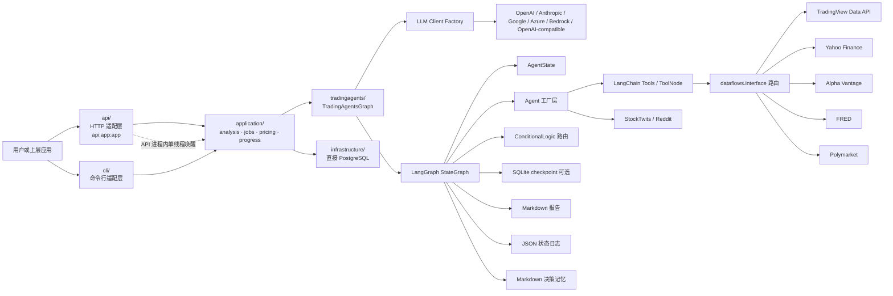
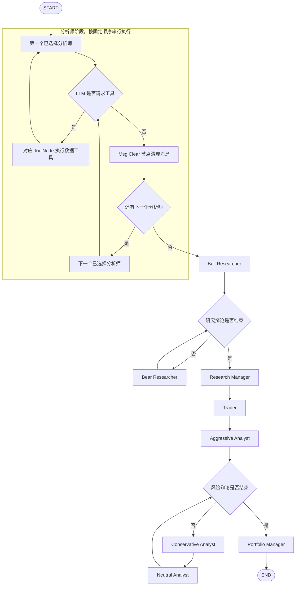
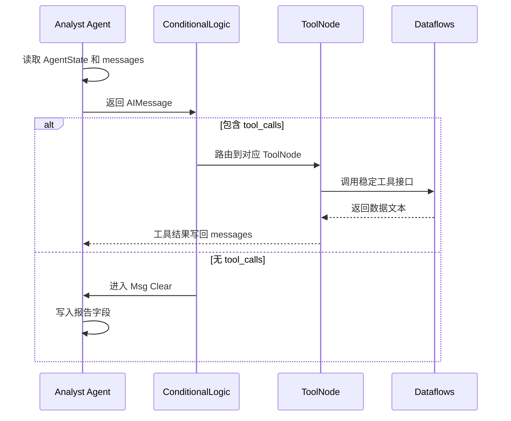
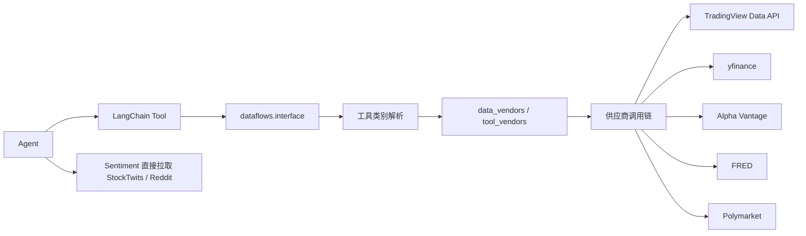
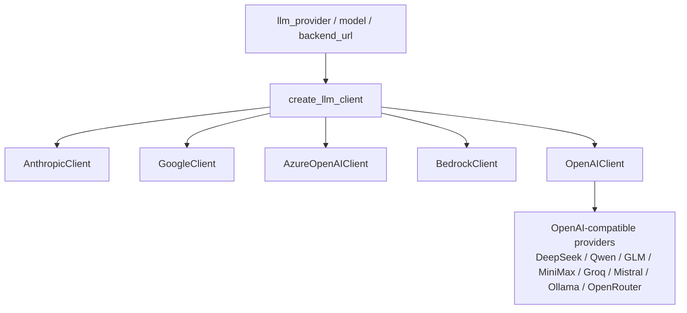

# TradingAgents 工程架构设计与运行流程

> 生成日期：2026-07-12
> 分析对象：`tg-core`  
> 项目版本：`tradingagents 0.3.1`  
> 主要入口：`tradingagents` CLI、HTTP 服务 `api.app:app`、程序化 `TradingAgentsGraph`

## 1. 项目定位

TradingAgents 是一个基于 LangGraph 和 LLM 的多 Agent 金融投研框架。它将一次标的分析拆成多个角色协作：

1. 分析师团队收集和解释市场、情绪、新闻、基本面数据。
2. 多头和空头研究员围绕分析结果辩论。
3. Research Manager 汇总辩论并生成投资计划。
4. Trader 将投资计划转成交易提案。
5. 风险团队从激进、中性、保守三个角度评估提案。
6. Portfolio Manager 输出最终组合决策和五档评级。

当前工程产物是研究报告、结构化决策文本、状态日志和可选记忆日志，不包含真实下单、券商接入、成交回报或账户资金管理。

## 2. 技术栈

| 领域 | 技术 |
|---|---|
| 语言与打包 | Python 3.10+、setuptools、PEP 621 |
| Agent 编排 | LangGraph、LangChain Core、ToolNode |
| LLM Provider | OpenAI 兼容接口、Anthropic、Google、Azure OpenAI、AWS Bedrock |
| 数据源 | TradingView Data API（RapidAPI）、Yahoo Finance、Alpha Vantage、FRED、Polymarket、StockTwits、Reddit |
| 数据处理 | pandas、yfinance、stockstats |
| 结构化输出 | Pydantic |
| CLI | Typer、Questionary、Rich |
| 持久化 | Markdown、JSON、SQLite checkpoint |
| 容器化 | Docker、Docker Compose |
| 测试与质量 | pytest、Ruff |

## 3. 目录结构

```text
tg-core/
├── api/                         # FastAPI HTTP 适配层，唯一 Uvicorn 入口 api.app:app
│   ├── app.py                    # 路由、生命周期、鉴权与响应
│   └── job_worker.py             # API 进程内单线程 job 唤醒队列
├── application/                 # CLI/API 共享用例
│   ├── analysis.py               # 共享分析执行
│   ├── jobs.py                   # PostgreSQL job 用例与报告保存
│   ├── pricing.py                # 价格刷新协调
│   └── progress.py               # 分析进度估算
├── infrastructure/              # 直接 PostgreSQL 实现
│   ├── database.py
│   ├── analysis_jobs.py
│   └── llm_prices.py
├── cli/                         # Typer + Rich 交互式命令行
│   ├── main.py                   # CLI 主入口、实时 UI、报告保存
│   ├── utils.py                  # 交互选择、Provider、模型、API key、ticker 处理
│   └── models.py                 # CLI 枚举模型
├── tradingagents/
│   ├── graph/                    # LangGraph 状态图、路由、传播、checkpoint
│   ├── agents/                   # 各类 Agent 工厂、Prompt、状态更新
│   ├── dataflows/                # 数据供应商实现、路由、错误分类、ticker 标准化
│   ├── llm_clients/              # 多 Provider LLM 客户端适配
│   ├── default_config.py         # 默认配置与环境变量覆盖
│   └── reporting.py              # Markdown 报告树输出
├── tests/                        # pytest 测试
├── scripts/                      # 冒烟脚本
├── pyproject.toml                # 包、依赖、CLI 脚本、pytest、ruff 配置
├── Dockerfile
└── docker-compose.yml
```

## 4. 总体架构



核心设计是分层依赖：

```text
api / cli
  -> application
  -> TradingAgentsGraph
  -> GraphSetup / Propagator / ConditionalLogic
  -> Agent factories + AgentState + Schemas
  -> LangChain tools
  -> dataflows vendor router
  -> external data providers
```

`api/` 与 `cli/` 是并列适配层，保持直接函数调用：不引入 ports、Repository、依赖注入、ORM、Alembic 或外部队列。`application/` 调用 `infrastructure/` 的直接 PostgreSQL 实现。LLM Provider 由 `TradingAgentsGraph` 初始化后注入 Agent 工厂；Agent 不直接感知当前使用哪家模型供应商。

## 5. 核心模块职责

| 模块 | 责任 | 关键文件 |
|---|---|---|
| HTTP 适配 | 路由、鉴权、响应和生命周期 | `api/app.py`（`api.app:app`） |
| API job 唤醒 | API 进程内单线程队列，只调用 job 用例 | `api/job_worker.py` |
| 共享分析 | CLI/API 的 `AnalysisCommand` 与图执行 | `application/analysis.py` |
| Job 用例 | job 创建、领取、执行、报告、成本和状态更新 | `application/jobs.py` |
| 定价协调 | 刷新价格并回填已有 job 成本 | `application/pricing.py` |
| PostgreSQL | 直接 schema、job 和价格缓存读写 | `infrastructure/` |
| CLI 入口 | 交互式收集参数、实时展示进度、保存报告 | `cli/main.py` |
| 图总控 | 创建 LLM、工具节点、状态图、记忆、checkpoint、执行 propagate | `tradingagents/graph/trading_graph.py` |
| 图构建 | 注册节点和边，按用户选择构建分析师链路 | `tradingagents/graph/setup.py` |
| 条件路由 | 判断工具调用、研究辩论轮次、风险辩论轮次 | `tradingagents/graph/conditional_logic.py` |
| 状态初始化 | 创建初始 `AgentState`，设置递归限制和回调 | `tradingagents/graph/propagation.py` |
| Agent 状态 | 定义共享状态、研究辩论状态、风险辩论状态 | `tradingagents/agents/utils/agent_states.py` |
| Agent 工厂 | 构建分析师、研究员、交易员、风险员、经理节点 | `tradingagents/agents/` |
| 结构化输出 | 定义 ResearchPlan、TraderProposal、PortfolioDecision、SentimentReport | `tradingagents/agents/schemas.py` |
| 数据路由 | 将稳定工具方法路由到具体数据供应商 | `tradingagents/dataflows/interface.py` |
| LLM 适配 | 多 Provider 客户端工厂和能力差异处理 | `tradingagents/llm_clients/` |
| Token 与定价逻辑 | LLM callback、纯成本计算和价格刷新判断 | `tradingagents/llm_clients/token_usage.py`、`pricing.py` |
| 报告输出 | 统一生成分阶段 Markdown 报告树 | `tradingagents/reporting.py` |

## 6. 运行入口

### 6.1 CLI 入口

安装后入口由 `pyproject.toml` 声明：

```toml
[project.scripts]
tradingagents = "cli.main:app"
```

常见启动方式：

```bash
tradingagents
python -m cli.main
```

CLI 流程：

1. 通过 Questionary 选择 ticker、日期、分析师、研究深度、LLM Provider、模型和输出语言。
2. 根据选择构建运行配置。
3. 创建 `TradingAgentsGraph`。
4. 初始化 Rich Live UI。
5. 创建初始 `AgentState`。
6. 调用 `graph.graph.stream()` 流式执行。
7. 实时更新 Agent 状态、报告片段、LLM 调用统计、工具调用统计。
8. 运行结束后询问是否保存报告和展示完整报告。

### 6.2 HTTP API 入口

唯一 Uvicorn 服务入口是 `api.app:app`：

```bash
uvicorn api.app:app --host 0.0.0.0 --port 8000
```

`api/app.py` 在服务生命周期中初始化 PostgreSQL、恢复待处理 job，并启动 `api/job_worker.py` 的单线程唤醒队列。worker 只从队列取得 job ID 后调用 `application.jobs.run_job()`；任务执行、状态写入、报告保存和成本计算不在 `api/` 中实现。

### 6.3 程序化图入口

`TradingAgentsGraph` 可由 Python 代码直接调用：

```python
from tradingagents.default_config import DEFAULT_CONFIG
from tradingagents.graph.trading_graph import TradingAgentsGraph

config = DEFAULT_CONFIG.copy()
ta = TradingAgentsGraph(debug=True, config=config)
_, decision = ta.propagate("NVDA", "2024-05-10")
print(decision)
```

`application.analysis.run_analysis()` 是 CLI 和 HTTP job 共用的执行入口，使用 `TradingAgentsGraph.propagate()` 处理记忆回填、状态日志、checkpoint 编译与清理和最终评级提取。

## 7. LangGraph 运行流程图



分析师固定顺序来自 `ANALYST_NODE_SPECS` 和 CLI 的 `ANALYST_ORDER`：

```text
Market -> Sentiment -> News -> Fundamentals
```

用户可以减少分析师，但已选分析师之间的相对顺序不变。Crypto 标的会在 CLI 层过滤掉 Fundamentals Analyst。

## 8. Agent 协作模型

### 8.1 分析师团队

| Agent | 输入 | 工具或数据 | 输出字段 |
|---|---|---|---|
| Market Analyst | ticker、日期、资产类型、标的身份上下文 | OHLCV、技术指标、验证快照 | `market_report` |
| Sentiment Analyst | ticker、日期、近 7 天窗口 | 配置的市场新闻供应商、StockTwits、Reddit | `sentiment_report` |
| News Analyst | ticker、日期、资产类型 | 标的新闻、全球新闻、内幕交易、宏观数据、预测市场 | `news_report` |
| Fundamentals Analyst | ticker、日期 | 公司概况、资产负债表、现金流、利润表 | `fundamentals_report` |

工具型分析师通过 LangGraph 条件边循环：



### 8.2 研究、交易和风控团队

| 阶段 | Agent | 模型 | 作用 |
|---|---|---|---|
| 研究辩论 | Bull Researcher、Bear Researcher | `quick_think_llm` | 构建多头和空头论据 |
| 研究裁决 | Research Manager | `deep_think_llm` | 输出五档投资建议和战略动作 |
| 交易提案 | Trader | `quick_think_llm` | 输出 Buy/Hold/Sell 交易动作 |
| 风险辩论 | Aggressive、Conservative、Neutral Analyst | `quick_think_llm` | 从不同风险偏好审查提案 |
| 最终裁决 | Portfolio Manager | `deep_think_llm` | 输出最终五档评级和组合决策 |

研究辩论终止条件：

```text
investment_debate_state.count >= 2 * max_debate_rounds
```

风险辩论终止条件：

```text
risk_debate_state.count >= 3 * max_risk_discuss_rounds
```

## 9. 状态模型

核心状态类型是 `AgentState`，继承 LangGraph 的 `MessagesState`。主要字段：

| 分组 | 字段 |
|---|---|
| 运行身份 | `company_of_interest`、`asset_type`、`instrument_context`、`trade_date` |
| 消息控制 | `messages`、`sender` |
| 分析报告 | `market_report`、`sentiment_report`、`news_report`、`fundamentals_report` |
| 研究和交易 | `investment_debate_state`、`investment_plan`、`trader_investment_plan` |
| 风险和结论 | `risk_debate_state`、`final_trade_decision`、`past_context` |

`Propagator.create_initial_state()` 初始化 ticker、日期、资产类型、历史上下文、标的身份上下文，以及空的辩论状态和报告字段。

## 10. 数据访问架构



数据工具按类别组织：

| 类别 | 工具 |
|---|---|
| 标的身份 | `get_instrument_identity` |
| 行情 | `get_stock_data` |
| 技术指标 | `get_indicators`、`get_verified_market_snapshot` |
| 基本面 | `get_fundamentals`、`get_balance_sheet`、`get_cashflow`、`get_income_statement` |
| 新闻和内幕交易 | `get_news`、`get_global_news`、`get_insider_transactions` |
| 宏观 | `get_macro_indicators` |
| 预测市场 | `get_prediction_markets` |

默认供应商配置：

```python
data_vendors = {
    "instrument_data": "tradingview,yfinance",
    "core_stock_apis": "tradingview,yfinance,alpha_vantage",
    "technical_indicators": "tradingview,yfinance,alpha_vantage",
    "fundamental_data": "tradingview,yfinance,alpha_vantage",
    "news_data": "tradingview,yfinance,alpha_vantage",
    "macro_data": "fred",
    "prediction_markets": "polymarket",
}

tool_vendors = {
    "get_insider_transactions": "yfinance,alpha_vantage",
}
```

`tool_vendors` 优先于 `data_vendors`。显式配置就是完整调用边界，不会静默加入未配置供应商；`"default"` 才会解析为不可变的方法级策略。默认策略为：身份 `tradingview,yfinance`；价格、OHLCV、技术指标、基本面、财报、标的新闻和全球新闻 `tradingview,yfinance,alpha_vantage`；内部人交易 `yfinance,alpha_vantage`；宏观 `fred`；预测市场 `polymarket`。

若要覆盖某个类别的默认链路，可显式配置，例如：

```python
config["data_vendors"]["core_stock_apis"] = "tradingview,yfinance"
```

TradingView 从 `TRADINGVIEW_RAPIDAPI_KEY` 读取 RapidAPI key，并以 `RAPIDAPI_KEY` 作为后备。未配置 key 会触发 `VendorNotConfiguredError`：若链中仍有后续供应商，路由继续尝试；若 TradingView 是唯一供应商，则报告配置缺失。其日线 OHLCV 请求固定携带 `type=Japanese`，避免依赖上游默认 candle 类型。

结构化路径使用 `InstrumentRef`、`ProviderSymbol` 和 `ProviderResult` 保存原始标的、供应商符号和数据来源。`structured_data.get_ohlcv()` 与 `get_instrument_identity()` 通过同一能力路由调用供应商；市场验证快照、标的身份锚定和收益回填因此不再直接依赖 Yahoo 实现。TradingView 支持直接使用交易所代码，并会将常见输入确定性转换，例如 `0700.HK -> HKEX:700`、`600519.SS -> SSE:600519`、`BTC-USDT -> BINANCE:BTCUSDT`、`XAUUSD -> COMEX:GC1!`；裸股票代码通过市场搜索解析。

错误处理策略：

| 错误类型 | 行为 |
|---|---|
| `VendorRateLimitError` | 记录 warning，尝试下一个供应商 |
| `VendorNotConfiguredError` | 记录缺少配置，尝试下一个供应商 |
| `NoMarketDataError` | 尝试下一个供应商，全部失败后返回 `NO_DATA_AVAILABLE` |
| 其他异常 | 记录真实错误，尝试下一个供应商 |

FRED 和 Polymarket 属于可选增强数据，失败时返回 `DATA_UNAVAILABLE` 哨兵，不阻断主流程。

## 11. LLM 适配架构



Provider 特有参数由 `TradingAgentsGraph._get_provider_kwargs()` 统一注入：

| Provider | 特有配置 |
|---|---|
| Google | `google_thinking_level` |
| OpenAI | `openai_reasoning_effort` |
| Anthropic | `anthropic_effort` |
| 全部 Provider | `temperature`、`llm_max_retries` |

结构化输出主要用于 Research Manager、Trader、Portfolio Manager 和 Sentiment Analyst。若 Provider 不支持或结构化调用失败，系统会回退到自由文本路径，再渲染成下游可读的 Markdown。

## 12. 持久化与输出

### 12.1 程序化状态日志

`TradingAgentsGraph.propagate()` 成功后写入完整状态 JSON：

```text
~/.tradingagents/logs/<TICKER>/TradingAgentsStrategy_logs/full_states_log_<YYYY-MM-DD>.json
```

### 12.2 Markdown 报告树

`write_report_tree()` 生成统一报告目录：

```text
<save_path>/
├── 1_analysts/
│   ├── market.md
│   ├── sentiment.md
│   ├── news.md
│   └── fundamentals.md
├── 2_research/
│   ├── bull.md
│   ├── bear.md
│   └── manager.md
├── 3_trading/
│   └── trader.md
├── 4_risk/
│   ├── aggressive.md
│   ├── conservative.md
│   └── neutral.md
├── 5_portfolio/
│   └── decision.md
└── complete_report.md
```

### 12.3 决策记忆

`TradingMemoryLog` 使用追加式 Markdown 文件：

```text
~/.tradingagents/memory/trading_memory.md
```

生命周期：

1. 当前 `propagate()` 完成后保存 pending 决策。
2. 下次分析同一 ticker 时，查询后续约 5 个交易日收益和地区基准收益。
3. 计算 raw return 和 alpha return。
4. 调用快速模型生成反思。
5. 原子更新日志，并把最近经验注入 Portfolio Manager prompt。

### 12.4 Checkpoint

Checkpoint 使用 `langgraph-checkpoint-sqlite`，每个 ticker 一个 SQLite 文件：

```text
~/.tradingagents/cache/checkpoints/<SAFE_TICKER>.db
```

thread ID 由 ticker、日期和图形状签名生成。图形状签名包含分析师选择、研究辩论轮数、风险辩论轮数和资产类型，避免错误恢复到不兼容图。

## 13. 部署方式

### 13.1 本地安装

```bash
pip install .
tradingagents
```

### 13.2 Docker

```bash
cp .env.example .env
docker compose run --rm tradingagents
```

### 13.3 Docker + Ollama

```bash
docker compose --profile ollama run --rm tradingagents-ollama
```

Docker 镜像使用 Python 3.12 slim，多阶段构建，运行阶段使用非 root 用户 `appuser`，默认入口是 `tradingagents`。

## 14. 配置优先级

配置来源：

1. `DEFAULT_CONFIG` 提供默认值。
2. `TRADINGAGENTS_*` 环境变量在 import 时覆盖默认配置。
3. CLI 交互选择覆盖本次运行配置。
4. 显式命令行参数如 `--checkpoint/--no-checkpoint` 在传入时覆盖 checkpoint 设置。

主要环境变量：

| 环境变量 | 配置键 |
|---|---|
| `TRADINGAGENTS_LLM_PROVIDER` | `llm_provider` |
| `TRADINGAGENTS_DEEP_THINK_LLM` | `deep_think_llm` |
| `TRADINGAGENTS_QUICK_THINK_LLM` | `quick_think_llm` |
| `TRADINGAGENTS_LLM_BACKEND_URL` | `backend_url` |
| `TRADINGAGENTS_OUTPUT_LANGUAGE` | `output_language` |
| `TRADINGAGENTS_MAX_DEBATE_ROUNDS` | `max_debate_rounds` |
| `TRADINGAGENTS_MAX_RISK_ROUNDS` | `max_risk_discuss_rounds` |
| `TRADINGAGENTS_CHECKPOINT_ENABLED` | `checkpoint_enabled` |
| `TRADINGAGENTS_TEMPERATURE` | `temperature` |
| `TRADINGAGENTS_LLM_MAX_RETRIES` | `llm_max_retries` |

布尔值和整数会在启动阶段强校验，非法值会直接报错，避免静默误配置。

## 15. 测试覆盖重点

测试目录覆盖以下高风险区域：

| 区域 | 示例 |
|---|---|
| 图路由 | 研究和风险路由 path map、round limit |
| Checkpoint | SQLite 恢复、thread id、图形状签名 |
| Provider | OpenAI 兼容、Google、Anthropic、Bedrock、MiniMax、DeepSeek |
| 配置 | 环境变量覆盖、CLI 配置优先级 |
| 数据供应商 | vendor fallback、rate limit、not configured、no data |
| 日期正确性 | Yahoo 与 TradingView 的 OHLCV 边界、新闻 look-ahead 过滤、陈旧 OHLCV 拒绝 |
| 标的处理 | ticker 标准化、安全路径组件、crypto asset mode |
| 结构化输出 | Pydantic schema、自由文本 fallback、评级解析 |
| 报告 | 报告树输出和 HTTP job 保存路径 |

## 16. 当前实现边界

1. CLI 与 HTTP API 通过 `application.analysis.run_analysis()` 共享图执行。CLI 负责 Rich UI 和本地报告交互；HTTP job 负责 PostgreSQL 状态和 API 报告路径。`api/job_worker.py` 是 API 进程内单线程唤醒队列，不是独立 worker 服务。
2. 分析师阶段当前串行执行。四类分析师理论上可并行，但现有图按固定顺序执行，并在阶段之间清理消息。
3. 数据配置保存在 `dataflows.config` 的模块级全局变量中。同进程并发运行多个不同配置任务时可能互相影响。
4. 历史日期分析仍可能混入实时情绪源。StockTwits、Reddit 和 Polymarket 不是历史快照。
5. 项目不执行真实交易，也没有模拟交易所的订单撮合实现。
6. `requirements.txt` 仅包含 `.`，实际依赖由 `pyproject.toml` 管理，当前没有锁文件。

## 17. 扩展建议

### 17.1 新增分析师

1. 在 `tradingagents/agents/analysts/` 新增 `create_*_analyst(llm)`。
2. 在 `AgentState` 增加报告字段。
3. 在 `ANALYST_NODE_SPECS` 注册 agent 节点、clear 节点、tool 节点和报告字段。
4. 在 `TradingAgentsGraph._create_tool_nodes()` 注册工具集合。
5. 在 `GraphSetup.setup_graph()` 增加 factory 映射。
6. 在 `ConditionalLogic` 增加对应 `should_continue_*`。
7. 在 CLI 状态展示和报告保存映射中补齐名称。
8. 增加路由、报告字段和 CLI 选择测试。

### 17.2 新增数据供应商

1. 在 `tradingagents/dataflows/` 实现供应商函数。
2. 使用 `VendorRateLimitError`、`VendorNotConfiguredError`、`NoMarketDataError` 表达可路由故障。
3. 在 `VENDOR_METHODS` 中注册能力。
4. 必要时更新默认配置和 `VENDOR_LIST`。
5. 增加供应商路由和错误分类测试。

对于需要供市场验证、身份锚定或收益计算复用的数据，适配器还应返回 `ProviderResult`，并在 `structured_data.py` 暴露 provider-neutral 入口；不要让图层或 Agent 直接调用某家供应商的 SDK。

### 17.3 新增 LLM Provider

如果服务兼容 OpenAI Chat Completions：

1. 在 OpenAI 兼容 Provider 注册表中添加 ProviderSpec。
2. 增加 API key 环境变量映射。
3. 增加模型目录和 CLI 展示项。
4. 如有特殊参数限制，更新模型能力表。

如果服务不是 OpenAI 兼容协议，则实现新的 `BaseLLMClient` 子类，并在 `create_llm_client()` 中注册。

## 18. 建议优化路线

| 优先级 | 建议 | 目标 |
|---|---|---|
| P0 | 保持 CLI 与 API 在 `application.analysis` 中共享执行 | 防止两种适配层再次分叉 |
| P0 | 明确 README 中研究框架和交易执行边界 | 避免误解为真实或模拟下单系统 |
| P1 | 将数据配置从模块全局状态改为运行级上下文 | 支持并发、服务化和多租户 |
| P1 | 设计分析师并行分支和稳定事件聚合 | 降低总运行延迟 |
| P1 | 引入依赖锁文件并清理未使用依赖 | 提高可复现性，缩小安装体积 |
| P2 | 输出机器可读的运行结果和解析状态 | 方便 API、数据库和前端消费 |
| P2 | 增加 trace id、成本、Provider 耗时和数据血缘 | 提升生产可观测性 |

## 19. 关键代码索引

| 主题 | 文件 |
|---|---|
| CLI 主流程 | [`cli/main.py`](../cli/main.py) |
| CLI 选择和配置 | [`cli/utils.py`](../cli/utils.py) |
| HTTP 服务入口 | [`api/app.py`](../api/app.py)（`api.app:app`） |
| API 进程内 job 唤醒 | [`api/job_worker.py`](../api/job_worker.py) |
| 共享分析用例 | [`application/analysis.py`](../application/analysis.py) |
| 持久化 job 用例 | [`application/jobs.py`](../application/jobs.py) |
| PostgreSQL 实现 | [`infrastructure/database.py`](../infrastructure/database.py)、[`infrastructure/analysis_jobs.py`](../infrastructure/analysis_jobs.py) |
| Token callback 与定价逻辑 | [`tradingagents/llm_clients/token_usage.py`](../tradingagents/llm_clients/token_usage.py)、[`tradingagents/llm_clients/pricing.py`](../tradingagents/llm_clients/pricing.py) |
| 总编排类 | [`tradingagents/graph/trading_graph.py`](../tradingagents/graph/trading_graph.py) |
| 图节点和边 | [`tradingagents/graph/setup.py`](../tradingagents/graph/setup.py) |
| 条件路由 | [`tradingagents/graph/conditional_logic.py`](../tradingagents/graph/conditional_logic.py) |
| 状态初始化 | [`tradingagents/graph/propagation.py`](../tradingagents/graph/propagation.py) |
| 状态类型 | [`tradingagents/agents/utils/agent_states.py`](../tradingagents/agents/utils/agent_states.py) |
| 结构化输出 Schema | [`tradingagents/agents/schemas.py`](../tradingagents/agents/schemas.py) |
| 数据路由 | [`tradingagents/dataflows/interface.py`](../tradingagents/dataflows/interface.py) |
| 结构化数据入口 | [`tradingagents/dataflows/structured_data.py`](../tradingagents/dataflows/structured_data.py) |
| Provider-neutral 类型与 TradingView 符号解析 | [`tradingagents/dataflows/provider_models.py`](../tradingagents/dataflows/provider_models.py)、[`tradingagents/dataflows/tradingview_symbols.py`](../tradingagents/dataflows/tradingview_symbols.py) |
| Ticker 标准化 | [`tradingagents/dataflows/symbol_utils.py`](../tradingagents/dataflows/symbol_utils.py) |
| LLM 工厂 | [`tradingagents/llm_clients/factory.py`](../tradingagents/llm_clients/factory.py) |
| 默认配置 | [`tradingagents/default_config.py`](../tradingagents/default_config.py) |
| 决策记忆 | [`tradingagents/agents/utils/memory.py`](../tradingagents/agents/utils/memory.py) |
| SQLite checkpoint | [`tradingagents/graph/checkpointer.py`](../tradingagents/graph/checkpointer.py) |
| 报告输出 | [`tradingagents/reporting.py`](../tradingagents/reporting.py) |
| Docker 入口 | [`Dockerfile`](../Dockerfile) |
| Compose 服务 | [`docker-compose.yml`](../docker-compose.yml) |

## 20. 总结

TradingAgents 的核心是一个可配置的 LangGraph 多 Agent 状态机。它通过 Agent 层抽象投研角色，通过 dataflows 层隔离金融数据供应商，通过 llm_clients 层隔离模型供应商差异，通过 reporting、memory 和 checkpoint 保留运行结果与恢复能力。

当前工程已经对 Provider 差异、数据缺失、ticker 标准化、历史日期边界、结构化输出 fallback 和 checkpoint 恢复做了较多工程化处理。下一步最值得投入的是统一 CLI 和 API 生命周期、隔离运行级配置、澄清交易执行边界，并为分析师并行和生产可观测性建立基础。
