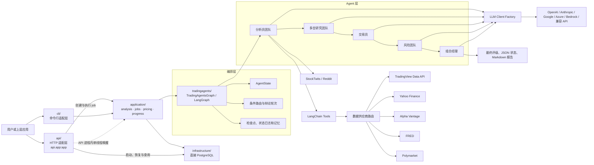
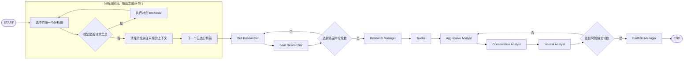

# TradingAgents 项目架构与技术说明

> 文档基线：当前代码（TradingAgents `v0.3.1`）
>
> 整理日期：2026-07-13
>
> 适用对象：项目维护者、二次开发者、技术评审人员和新成员

## 1. 文档目的

本文从当前仓库代码出发，说明 TradingAgents 的项目定位、总体架构、Agent 协作流程、技术栈、数据源、模型适配、配置、持久化、测试体系和扩展方式。

本文描述的是当前代码实际实现，而不是产品设想。对于 README 中存在、但尚未在核心代码路径中完整实现的能力，会在“现状边界与技术债”中单独说明。

## 2. 项目定位

TradingAgents 是一个用大语言模型模拟投研团队协作的金融研究框架。系统接收证券或加密资产代码和分析日期，依次完成：

1. 市场、情绪、新闻和基本面分析。
2. 多头与空头研究员辩论。
3. 研究经理形成投资计划。
4. 交易员形成交易提案。
5. 激进、中性、保守三类风险角色辩论。
6. 组合经理给出最终评级。
7. 保存分析状态、报告和可选的历史决策记忆。

系统的核心产物是研究报告和五档仓位评级：`Buy`、`Overweight`、`Hold`、`Underweight`、`Sell`。它是研究与决策生成框架，不是券商接入、订单执行或实盘交易系统。

## 3. 仓库概况

仓库的主要目录如下：

```text
TradingAgents/
├── api/                         # FastAPI HTTP 适配层，唯一服务入口 api.app:app
├── application/                 # CLI/API 共享分析、job、定价与进度用例
├── infrastructure/              # 直接 PostgreSQL 实现
├── cli/                         # Typer + Rich 交互式命令行
├── scripts/                     # 结构化输出真实模型冒烟脚本
├── tests/                       # pytest 单元、集成和冒烟测试
├── tradingagents/
│   ├── agents/                  # 各类分析、研究、交易和风控 Agent
│   │   ├── analysts/
│   │   ├── managers/
│   │   ├── researchers/
│   │   ├── risk_mgmt/
│   │   ├── trader/
│   │   ├── schemas.py           # Pydantic 结构化输出模型
│   │   └── utils/               # LangChain 工具、记忆、评级与公共逻辑
│   ├── dataflows/               # 数据源实现、路由、错误分类和标的标准化
│   ├── graph/                   # LangGraph 状态图、路由、传播和检查点
│   ├── llm_clients/             # 多模型供应商适配与能力表
│   ├── default_config.py        # 默认配置和环境变量覆盖
│   └── reporting.py             # 统一报告目录写入
├── pyproject.toml               # 打包、依赖、pytest 和 Ruff 配置
└── ../docker/
    ├── Dockerfile.core
    ├── Dockerfile.web
    └── docker-compose.yml
```

核心模块职责：

| 模块 | 职责 | 主要入口 |
|---|---|---|
| `tradingagents.graph` | 构建和执行多 Agent 状态图 | `TradingAgentsGraph` |
| `tradingagents.agents` | 定义角色、提示词和状态更新 | `create_*` Agent 工厂 |
| `tradingagents.dataflows` | 接入并路由金融数据供应商 | `route_to_vendor()` |
| `tradingagents.llm_clients` | 创建不同供应商的聊天模型 | `create_llm_client()` |
| `tradingagents.reporting` | 输出分阶段 Markdown 报告 | `write_report_tree()` |
| `application` | CLI/API 共享分析、持久化 job、定价协调和进度估算 | `run_analysis()`、`run_job()` |
| `infrastructure` | 直接 PostgreSQL 连接、job 和模型价格读写 | `database.connect()` |
| `api` | HTTP 路由、鉴权、序列化和进程内 job 唤醒 | `api.app:app` |
| `cli` | 收集参数、终端展示和报告交互 | `tradingagents` 命令 |

## 4. 总体架构

项目采用分层架构。`api/` 与 `cli/` 是并列适配层，二者经由 `application/` 调用共享分析用例；状态图负责编排，Agent 负责推理和状态转换，工具层统一金融数据接口，供应商层处理外部 API 差异。`infrastructure/` 只直接实现 PostgreSQL 访问。



### 4.1 分层依赖方向

推荐理解为以下单向依赖：

```text
cli
        ↓
application
        ↓
TradingAgentsGraph / GraphSetup
        ↓
Agent factories + AgentState + Pydantic schemas
        ↓
LangChain tools
        ↓
dataflows.interface
        ↓
具体数据供应商

application → infrastructure（job 状态与定价协调的直接 PostgreSQL 函数调用）
api → application（创建与执行 job）
api → infrastructure（服务启动、恢复、任务查询与价格缓存）
```

LLM 适配层由 `TradingAgentsGraph` 在初始化阶段创建，并在构造 Agent 时作为普通参数传给 Agent 工厂。Agent 不直接判断当前使用哪家模型供应商。

## 5. 端到端执行流程

### 5.1 主流程



分析员顺序由 `cli.utils.ANALYST_ORDER` 和 `graph.analyst_execution.ANALYST_NODE_SPECS` 固定为：

```text
Market → Sentiment → News → Fundamentals
```

用户可以取消部分分析员，但不能改变已选分析员之间的相对顺序。加密资产模式会在 CLI 层自动移除基本面分析员。

### 5.2 单个工具型分析员循环

市场、新闻和基本面分析员使用 LangChain tool calling：

1. Agent 读取当前 `messages` 和共享状态。
2. LLM 返回工具调用时，LangGraph 路由到对应 `ToolNode`。
3. 工具结果加入消息列表，再回到同一个 Agent。
4. LLM 不再返回工具调用时，将最终内容写入对应报告字段。
5. `create_msg_delete()` 删除上一阶段消息，并加入带标的、日期和资产类型的占位消息。

情绪分析员是例外：它在节点内部直接预取配置的市场新闻供应商、StockTwits 和 Reddit 数据，再执行一次结构化 LLM 调用。它不会走 `tools_social` 循环；保留该 ToolNode 主要是为了兼容现有图结构和旧的 `social` wire key。

### 5.3 辩论轮次

- 多空研究阶段每轮包含 Bull 和 Bear 两次发言，终止条件为 `count >= 2 * max_debate_rounds`。
- 风险阶段每轮包含 Aggressive、Conservative、Neutral 三次发言，终止条件为 `count >= 3 * max_risk_discuss_rounds`。
- CLI 的浅、中、深研究深度分别映射为 1、3、5 轮。
- 共享条件边使用完整 `path_map`，即使角色标签出现提示词、国际化或重构漂移，也不会因缺失目标节点直接使 LangGraph 崩溃。

### 5.4 快速模型与深度模型分工

系统一次创建两个模型实例：

| 角色 | 使用模型 |
|---|---|
| Market / Sentiment / News / Fundamentals Analyst | `quick_think_llm` |
| Bull / Bear Researcher | `quick_think_llm` |
| Research Manager | `deep_think_llm` |
| Trader | `quick_think_llm` |
| Aggressive / Conservative / Neutral Risk Analyst | `quick_think_llm` |
| Portfolio Manager | `deep_think_llm` |
| 历史决策反思 | `quick_think_llm` |

这种分工把高频资料处理和辩论放在较快模型上，把最终综合判断放在深度模型上，以降低延迟和成本。

## 6. Agent 体系

### 6.1 分析员团队

| Agent | 输入 | 工具或外部数据 | 输出字段 |
|---|---|---|---|
| Market Analyst | 标的、日期、身份上下文 | OHLCV、技术指标、验证快照 | `market_report` |
| Sentiment Analyst | 标的、近 7 天窗口 | 配置的市场新闻供应商、StockTwits、Reddit | `sentiment_report` |
| News Analyst | 标的、日期、资产类型 | 标的新闻、全球新闻、FRED、Polymarket | `news_report` |
| Fundamentals Analyst | 标的、日期 | 公司概况、资产负债表、现金流、利润表 | `fundamentals_report` |

市场分析员最多选择 8 个互补指标，支持的主要指标包括：

- 趋势：`close_10_ema`、`close_50_sma`、`close_200_sma`
- 动量：`macd`、`macds`、`macdh`、`rsi`
- 波动：`boll`、`boll_ub`、`boll_lb`、`atr`
- 量价：`vwma`，数据实现还支持 `mfi`

### 6.2 研究团队

Bull 和 Bear 读取全部分析员报告及已有辩论历史，分别构建支持和反对持仓的论据。Research Manager 使用深度模型，将辩论转成 `ResearchPlan`：

```text
recommendation: Buy | Overweight | Hold | Underweight | Sell
rationale: 主要判断依据
strategic_actions: 给交易员的具体执行建议
```

### 6.3 交易员

Trader 把研究计划转换为 `TraderProposal`：

```text
action: Buy | Hold | Sell
reasoning: 2-4 句交易理由
entry_price: 可选入场价
stop_loss: 可选止损价
position_sizing: 可选仓位建议
```

交易员只使用三档方向，因为其职责是形成买入、持有或卖出的交易提案；更细的 `Overweight` 和 `Underweight` 由组合经理在最终仓位评级中处理。

### 6.4 风险团队与组合经理

风险团队从三种立场审查交易员提案：

| 角色 | 关注点 |
|---|---|
| Aggressive Analyst | 高风险高收益机会、增长上行和错失机会成本 |
| Conservative Analyst | 本金保护、波动、下行风险和长期可持续性 |
| Neutral Analyst | 收益与风险平衡、组合适配和中性方案 |

Portfolio Manager 使用深度模型综合研究计划、交易提案、风险辩论和历史经验，产生 `PortfolioDecision`：

```text
rating: Buy | Overweight | Hold | Underweight | Sell
executive_summary: 执行摘要
investment_thesis: 投资逻辑
price_target: 可选目标价
time_horizon: 可选持有期
```

最终由 `SignalProcessor` 用确定性文本解析提取五档评级，不再额外调用 LLM。

## 7. 状态模型与数据传递

LangGraph 的共享状态类型为 `AgentState`，继承自 `MessagesState`。关键字段分为五组：

| 分组 | 字段 |
|---|---|
| 运行身份 | `company_of_interest`、`asset_type`、`instrument_context`、`trade_date` |
| 消息控制 | `messages`、`sender` |
| 分析报告 | `market_report`、`sentiment_report`、`news_report`、`fundamentals_report` |
| 研究与交易 | `investment_debate_state`、`investment_plan`、`trader_investment_plan` |
| 风险与结论 | `risk_debate_state`、`final_trade_decision`、`past_context` |

`InvestDebateState` 保存多空各自历史、合并历史、当前发言、经理判断和发言计数。`RiskDebateState` 保存三方历史、最近发言者、当前回应、组合经理判断和计数。

### 7.1 标的身份锚定

运行开始时，系统通过 provider-neutral 的身份路由查询标的名称、行业、板块、交易所和报价类型，并构造 `instrument_context`。默认链优先使用 TradingView，缺少数据或配置时回退到 Yahoo Finance。该上下文会传给所有 Agent，目的是防止模型仅根据价格形态误认公司。

身份查询具有以下特性：

- 先解析为 `InstrumentRef`，再由当前供应商解析实际代码。
- 进程内最多缓存 256 个标的。
- 网络或限流失败时 fail-open，退化为仅包含 ticker 的上下文，不阻断主流程。
- 加密资产会被明确标为 asset，并提示不要假设存在公司基本面。

## 8. 数据访问架构

### 8.1 工具接口

Agent 通过 12 个 LangChain 工具访问数据：

| 类别 | 工具 |
|---|---|
| 行情 | `get_stock_data` |
| 技术指标 | `get_indicators`、`get_verified_market_snapshot` |
| 基本面 | `get_fundamentals`、`get_balance_sheet`、`get_cashflow`、`get_income_statement` |
| 新闻与内部人交易 | `get_news`、`get_global_news`、`get_insider_transactions` |
| 宏观 | `get_macro_indicators` |
| 预测市场 | `get_prediction_markets` |

工具只是薄封装，除验证快照外，统一进入 `dataflows.interface.route_to_vendor()`。

### 8.2 数据供应商矩阵

| 能力 | TradingView | Yahoo Finance | Alpha Vantage | FRED | Polymarket | StockTwits | Reddit |
|---|---:|---:|---:|---:|---:|---:|---:|
| 标的身份 | 是 | 是 | 否 | 否 | 否 | 否 | 否 |
| OHLCV | 是 | 是 | 是 | 否 | 否 | 否 | 否 |
| 技术指标 | 本地 stockstats 计算 | 本地 stockstats 计算 | 是 | 否 | 否 | 否 | 否 |
| 公司基本面与财报 | 是 | 是 | 是 | 否 | 否 | 否 | 否 |
| 标的新闻 | 是 | 是 | 是 | 否 | 否 | 否 | 否 |
| 全球新闻 | 是 | 是 | 是 | 否 | 否 | 否 | 否 |
| 内部人交易 | 否 | 是 | 是 | 否 | 否 | 否 | 否 |
| 宏观时间序列 | 否 | 否 | 否 | 是 | 否 | 否 | 否 |
| 事件概率 | 否 | 否 | 否 | 否 | 是 | 否 | 否 |
| 社交情绪 | 否 | 否 | 否 | 否 | 否 | 是 | 是 |

默认配置使用：

```python
data_vendors = {
    "instrument_data": "tradingview,yfinance",
    "core_stock_apis": "tradingview,yfinance,alpha_vantage",
    "technical_indicators": "tradingview,yfinance,alpha_vantage",
    "fundamental_data": "tradingview,yfinance,alpha_vantage",
    "news_data": "tradingview,yfinance,alpha_vantage",
    "macro_data": "fred",
    "prediction_markets": "polymarket",
}
```

### 8.3 供应商路由规则

供应商配置就是实际调用链，不会静默加入未选择的供应商。例如：

```python
config["data_vendors"]["core_stock_apis"] = "tradingview,yfinance"
```

表示先调用 TradingView，只有在限流、未配置或无数据等情况下才尝试 Yahoo Finance。`tool_vendors` 可以覆盖单个工具，并且优先级高于类别配置。显式链是完整边界，路由绝不会尝试链外供应商；设为 `"default"` 才会使用不可变的方法级默认链。

方法级默认链为：身份 `tradingview,yfinance`；价格、OHLCV、技术指标、基本面、财报、标的新闻和全球新闻 `tradingview,yfinance,alpha_vantage`；内部人交易 `yfinance,alpha_vantage`；宏观 `fred`；预测市场 `polymarket`。默认 `tool_vendors` 将内部人交易固定为 `yfinance,alpha_vantage`，因此它优先于 `news_data` 类别链。

TradingView 使用 `TRADINGVIEW_RAPIDAPI_KEY`，其优先级高于 `RAPIDAPI_KEY`。没有任一 key 时，`VendorNotConfiguredError` 会让包含后续供应商的链继续回退；只有没有后续供应商时才会报告配置缺失。每日 OHLCV 请求始终显式传递 `type=Japanese`，不能依赖上游默认 candle 类型。

路由层用统一错误类型决定行为：

| 错误 | 路由行为 |
|---|---|
| `VendorRateLimitError` | 记录警告，尝试链中下一供应商 |
| `VendorNotConfiguredError` | 记录缺少密钥或配置，尝试下一供应商 |
| `NoMarketDataError` | 尝试下一供应商；全部失败后返回明确的 `NO_DATA_AVAILABLE` |
| 其他异常 | 记录真实错误，尝试下一供应商 |

FRED 和 Polymarket 属于可选增强数据。它们失败时返回 `DATA_UNAVAILABLE` 哨兵，让新闻分析继续运行。价格、基本面和新闻等核心数据在真实错误无法恢复时会抛出异常。

### 8.4 标的代码标准化

`normalize_symbol()` 保留为 Yahoo 兼容入口。新的 provider-neutral 路径先解析 `InstrumentRef`，再由 TradingView 符号解析器处理；主要 TradingView 映射如下：

| 用户输入 | TradingView 代码 |
|---|---|
| `NASDAQ:AAPL` | `NASDAQ:AAPL` |
| `0700.HK` | `HKEX:700` |
| `600519.SS` | `SSE:600519` |
| `BTC-USDT` | `BINANCE:BTCUSDT` |
| `EURUSD` | `OANDA:EURUSD` |
| `SPX500` | `SP:SPX` |
| `XAUUSD` | `COMEX:GC1!` |

裸股票（如 `AAPL`）通过 TradingView 市场搜索解析。Yahoo 兼容规则仍适用于它的 adapter：

| 用户输入 | Yahoo 标准代码 | 规则 |
|---|---|---|
| `XAUUSD`、`GOLD` | `GC=F` | 贵金属映射到期货 |
| `EURUSD` | `EURUSD=X` | 外汇六位代码加 `=X` |
| `BTCUSD`、`BTC-USDT` | `BTC-USD` | 加密资产统一 USD 交易对 |
| `SPX500`、`US500` | `^GSPC` | 指数 CFD 映射到底层指数 |
| `0700.HK`、`7203.T` | 原样大写 | 保留交易所后缀 |

StockTwits 会把加密资产转换为 `<BASE>.X`，Reddit 搜索会转换为基础币种代码，以适配各自平台的符号规则。

### 8.5 数据正确性保护

当前代码包含多层防幻觉和防未来数据措施：

1. yfinance 的 `end` 是开区间，代码主动加一天，保证用户指定的结束日期被包含。
2. OHLCV 会检查最新行是否相对分析日期过旧，拒绝陈旧行情。
3. 财报按分析日期过滤，避免历史分析读取未来发布的报表。
4. 新闻窗口按发布日期过滤，避免 look-ahead。
5. `build_verified_market_snapshot()` 再次排除分析日期之后的行，并确定性计算固定指标集。
6. 市场分析员被要求以验证快照作为精确价格、OHLCV 和指标数值的唯一事实基准。
7. 无数据时返回带“不得估算或编造”指令的明确哨兵。

## 9. LLM 适配架构

### 9.1 工厂与供应商

`create_llm_client(provider, model, base_url, **kwargs)` 返回统一的 `BaseLLMClient`。供应商模块采用延迟导入，避免仅导入项目时就加载所有 SDK 或要求全部 API key。

原生 API 客户端：

- Anthropic：`ChatAnthropic`
- Google：`ChatGoogleGenerativeAI`
- Azure OpenAI：`AzureChatOpenAI`
- Amazon Bedrock：`ChatBedrockConverse`，通过可选依赖 `langchain-aws`

OpenAI 兼容注册表包含以下 provider key：

- `openai`、`xai`、`deepseek`
- `qwen`、`qwen-cn`
- `glm`、`glm-cn`
- `minimax`、`minimax-cn`
- `openrouter`、`mistral`、`kimi`、`groq`、`nvidia`
- `ollama`
- `openai_compatible`

CLI 主菜单将区域变体放在二级选择中，因此用户看到 17 个供应商选项；代码内部共有 20 个 provider key。

### 9.2 OpenAI 兼容注册表

`ProviderSpec` 声明每个兼容供应商的：

- 默认 base URL 和可选环境覆盖。
- API key 是否可选。
- 是否强制提供 base URL。
- 使用的 `ChatOpenAI` 子类。
- 是否启用 OpenAI Responses API。

原生 OpenAI 且 base URL 指向 OpenAI 官方域名时使用 Responses API；一旦配置代理、网关或本地地址，就回退到 Chat Completions，避免向兼容服务发送其不支持的 `/responses` 请求。

### 9.3 模型能力表

`ModelCapabilities` 集中描述模型是否支持：

- `tool_choice`
- JSON mode
- JSON Schema
- 首选结构化输出方式
- reasoning content 回传
- MiniMax reasoning split

DeepSeek thinking 模型和 MiniMax M2.x 对 `tool_choice`、思考内容等参数存在特殊限制，代码通过能力表和专用 `ChatOpenAI` 子类处理，而不是把模型判断散落在 Agent 中。

### 9.4 结构化输出与降级

Sentiment Analyst、Research Manager、Trader 和 Portfolio Manager 使用 Pydantic Schema。标准调用路径为：

```text
LLM.with_structured_output(Schema)
        ↓
得到 Pydantic 实例
        ↓
render_* 转成稳定 Markdown
        ↓
下游 Agent、报告和记忆仍消费文本
```

如果供应商不支持结构化输出，或调用返回空解析结果、无效 JSON、瞬时错误，`invoke_structured_or_freetext()` 会记录警告并用相同提示词执行一次普通文本调用。这样保留跨供应商兼容性，但降级后的文本不再具备 Pydantic 的字段和范围保证。

## 10. 配置体系

### 10.1 默认配置

配置源位于 `tradingagents/default_config.py`。重要配置如下：

| 配置项 | 默认值 | 作用 |
|---|---|---|
| `results_dir` | `~/.tradingagents/logs` | 状态和 CLI 中间产物目录 |
| `data_cache_dir` | `~/.tradingagents/cache` | 缓存和 SQLite 检查点目录 |
| `memory_log_path` | `~/.tradingagents/memory/trading_memory.md` | 决策记忆日志 |
| `memory_log_max_entries` | `None` | 已解决记忆的可选保留上限 |
| `llm_provider` | `openai` | 模型供应商 |
| `deep_think_llm` | `gpt-5.5` | 深度模型 |
| `quick_think_llm` | `gpt-5.4-mini` | 快速模型 |
| `backend_url` | `None` | 自定义模型端点 |
| `temperature` | `None` | 采样温度 |
| `llm_max_retries` | `None` | SDK 重试次数 |
| `google_thinking_level` | `None` | Gemini 思考级别 |
| `openai_reasoning_effort` | `None` | OpenAI 推理强度 |
| `anthropic_effort` | `None` | Claude effort |
| `checkpoint_enabled` | `False` | 是否启用节点级检查点 |
| `output_language` | `English` | 全部用户可见报告语言 |
| `max_debate_rounds` | `1` | 多空辩论轮数 |
| `max_risk_discuss_rounds` | `1` | 风险辩论轮数 |
| `max_recur_limit` | `100` | LangGraph 最大递归步数 |
| `news_article_limit` | `20` | 标的新闻数量上限 |
| `global_news_article_limit` | `10` | 全球新闻数量上限 |
| `global_news_lookback_days` | `7` | 全球新闻回看天数 |
| `global_news_queries` | 5 个宏观主题 | 全球新闻搜索主题 |
| `data_vendors` | 见数据章节 | 类别级供应商链 |
| `tool_vendors` | `{"get_insider_transactions": "yfinance,alpha_vantage"}` | 工具级供应商覆盖，优先于类别链 |
| `benchmark_ticker` | `None` | 强制收益基准 |
| `benchmark_map` | 地区指数映射 | 根据交易所后缀自动选择基准 |

### 10.2 配置优先级

程序导入 `tradingagents` 时会从当前工作目录查找并加载 `.env` 和 `.env.enterprise`，且不会覆盖进程中已经导出的变量。

总体优先级为：

```text
显式 CLI flag
    > 已导出的环境变量 / .env 中的 TRADINGAGENTS_* 覆盖
    > CLI 交互选择
    > DEFAULT_CONFIG
```

其中 `TRADINGAGENTS_MAX_DEBATE_ROUNDS`、`TRADINGAGENTS_MAX_RISK_ROUNDS` 和 `TRADINGAGENTS_CHECKPOINT_ENABLED` 被单独处理，以保证环境变量不会被 CLI 的默认交互值覆盖。

支持的核心覆盖变量包括：

```text
TRADINGAGENTS_LLM_PROVIDER
TRADINGAGENTS_DEEP_THINK_LLM
TRADINGAGENTS_QUICK_THINK_LLM
TRADINGAGENTS_LLM_BACKEND_URL
TRADINGAGENTS_OUTPUT_LANGUAGE
TRADINGAGENTS_MAX_DEBATE_ROUNDS
TRADINGAGENTS_MAX_RISK_ROUNDS
TRADINGAGENTS_CHECKPOINT_ENABLED
TRADINGAGENTS_BENCHMARK_TICKER
TRADINGAGENTS_TEMPERATURE
TRADINGAGENTS_LLM_MAX_RETRIES
TRADINGAGENTS_GOOGLE_THINKING_LEVEL
TRADINGAGENTS_OPENAI_REASONING_EFFORT
TRADINGAGENTS_ANTHROPIC_EFFORT
```

目录还可以通过 `TRADINGAGENTS_RESULTS_DIR`、`TRADINGAGENTS_CACHE_DIR` 和 `TRADINGAGENTS_MEMORY_LOG_PATH` 单独覆盖。

### 10.3 数据层全局配置

`dataflows.config` 在模块级保存一份深拷贝配置。`TradingAgentsGraph.__init__()` 会调用 `set_config()`，字典配置执行一层合并，标量直接替换。

这简化了 LangChain 工具签名，因为工具不必显式接收 config；代价是同一进程中多个不同配置的 `TradingAgentsGraph` 实例会共享并覆盖数据层配置，不适合无隔离地并发执行多租户任务。

## 11. 运行入口

### 11.1 交互式 CLI

安装后运行：

```bash
pip install .
tradingagents
```

或直接从源码运行：

```bash
python -m cli.main
```

CLI 依次收集 ticker、日期、语言、分析员、研究深度、模型供应商、快/慢模型和供应商特有的思考参数。Rich Live 界面展示 Agent 状态、工具调用、当前报告、耗时、LLM 调用次数和 token 统计。

公开命令选项：

```bash
tradingagents --checkpoint
tradingagents --no-checkpoint
tradingagents --clear-checkpoints
```

### 11.2 HTTP API

唯一 Uvicorn 服务入口是 `api.app:app`：

```bash
uvicorn api.app:app --host 0.0.0.0 --port 8000
```

`api/app.py` 处理 HTTP 生命周期、路由、鉴权、响应和任务查询。服务启动时，它初始化数据库、写入 fallback 模型价格、恢复中断 job、启动 `api/job_worker.py` 并回灌已排队 job；任务列表/详情和健康检查直接调用基础设施。该队列只调用 `application.jobs.run_job()`，不承载 job 业务逻辑。PostgreSQL schema、job 记录和模型价格缓存由 `infrastructure/` 直接实现。

### 11.3 程序化图入口

```python
from tradingagents.default_config import DEFAULT_CONFIG
from tradingagents.graph.trading_graph import TradingAgentsGraph

config = DEFAULT_CONFIG.copy()
config["llm_provider"] = "openai"
config["deep_think_llm"] = "gpt-5.5"
config["quick_think_llm"] = "gpt-5.4-mini"

graph = TradingAgentsGraph(
    selected_analysts=("market", "social", "news", "fundamentals"),
    config=config,
)
final_state, rating = graph.propagate("NVDA", "2026-01-15")
report = graph.save_reports(final_state, "NVDA")
```

`propagate()` 返回完整状态和五档评级。`save_reports()` 返回 `complete_report.md` 的路径。

### 11.4 Docker

```bash
cp tg-core/.env.example tg-core/.env
docker compose --env-file tg-core/.env -f docker/docker-compose.yml up --build postgres tradingagents-api
```

镜像使用 Python 3.12 多阶段构建、非 root 用户和持久化数据卷。Compose 以 `uvicorn api.app:app` 启动 HTTP API。

### 11.5 结构化输出冒烟脚本

`scripts/smoke_structured_output.py` 直接验证 Research Manager、Trader、Portfolio Manager 和 SignalProcessor，不运行完整数据分析链，因此成本较低：

```bash
OPENAI_API_KEY=... python scripts/smoke_structured_output.py openai
```

## 12. 输出与持久化

### 12.1 完整状态日志

Python API 的 `propagate()` 成功后写入：

```text
~/.tradingagents/logs/<TICKER>/TradingAgentsStrategy_logs/
└── full_states_log_<YYYY-MM-DD>.json
```

JSON 包含分析报告、两类辩论历史、研究计划、交易提案和最终决策。

### 12.2 报告目录

统一报告写入器产生：

```text
<save_path>/
├── 1_analysts/
│   ├── market.md
│   ├── sentiment.md
│   ├── news.md
│   └── fundamentals.md
├── 2_research/
│   ├── bull.md
│   ├── bear.md
│   └── manager.md
├── 3_trading/
│   └── trader.md
├── 4_risk/
│   ├── aggressive.md
│   ├── conservative.md
│   └── neutral.md
├── 5_portfolio/
│   └── decision.md
└── complete_report.md
```

只有存在内容的阶段和文件才会创建。

### 12.3 决策记忆

`TradingMemoryLog` 使用追加式 Markdown 文件，不依赖数据库：

```text
~/.tradingagents/memory/trading_memory.md
```

生命周期分两阶段：

1. 当前 `propagate()` 完成后保存 pending 决策。
2. 下次分析同一 ticker 时，查询约 5 个交易日后的标的收益和地区基准收益，计算 alpha，调用快速模型生成 2-4 句反思，再原子更新日志。

组合经理最多接收最近 5 条同标的完整经验和 3 条跨标的反思。可配置的轮转只删除最旧的已解决记录，不删除 pending 记录。

地区基准默认包括 SPY、Nifty 50、Sensex、日经 225、恒生指数、FTSE 100、TSX、ASX 200、上证综指和深证成指。

### 12.4 检查点

检查点使用 `langgraph-checkpoint-sqlite`，每个 ticker 一个数据库：

```text
~/.tradingagents/cache/checkpoints/<SAFE_TICKER>.db
```

thread ID 由 ticker、日期和图形状签名的 SHA-256 前 16 位构成。图形状签名包含分析员选择、两类辩论深度和资产类型，避免改变图配置后错误恢复旧状态。成功运行后清理该 thread 的检查点记录。

## 13. 技术栈

| 领域 | 技术 | 用途 |
|---|---|---|
| 语言与打包 | Python 3.10+、setuptools、PEP 621 | 核心实现和包发布 |
| Agent 编排 | LangGraph | 有状态图、条件边、工具节点、检查点 |
| LLM 抽象 | LangChain Core | 消息、提示词、工具调用、结构化输出、回调 |
| 模型 SDK | langchain-openai、langchain-anthropic、langchain-google-genai、可选 langchain-aws | 多模型供应商接入 |
| 数据处理 | pandas、yfinance、stockstats | OHLCV、财报和技术指标 |
| 市场数据 API | TradingView Data API（RapidAPI）、Yahoo Finance、Alpha Vantage、FRED、Polymarket | 行情、基本面、新闻、宏观和事件概率 |
| 网络与解析 | requests、urllib、ElementTree | TradingView、FRED、Polymarket、Alpha Vantage、Reddit、StockTwits |
| 数据模型 | Pydantic | Agent 结构化输出和字段校验 |
| CLI | Typer、Questionary、Rich | 命令、交互表单和实时终端界面 |
| 持久化 | PostgreSQL、SQLite、JSON、Markdown | API job、模型价格缓存、检查点、状态日志、决策记忆和报告 |
| 配置 | python-dotenv、环境变量、Python dict | 本地密钥和运行参数 |
| 容器 | Docker、Docker Compose | 标准运行环境和 Web profile |
| 质量 | pytest、Ruff、GitHub Actions | Python 3.10-3.13 测试、lint 和安装冒烟 |

## 14. 质量保障与可观测性

### 14.1 测试体系

测试体系重点覆盖：

- Agent 结构化输出、Schema 和自由文本降级。
- 模型能力表、provider registry 和 API key 映射。
- DeepSeek、MiniMax、OpenAI、Anthropic、Google、Bedrock 特有参数。
- 环境变量和 CLI 配置优先级。
- ticker 标准化、加密资产识别和路径安全。
- 数据供应商链、错误分类、无数据和限流处理。
- TradingView 符号解析、结构化 OHLCV / 身份 fallback，以及新闻、财报和 OHLCV 的日期边界及陈旧数据拒绝。
- LangGraph 检查点、图形状签名和清理。
- 记忆日志、收益回填、轮转和组合经理上下文注入。
- 报告目录和评级解析。

GitHub Actions 在 Python 3.10、3.11、3.12、3.13 上运行 pytest；另有干净安装导入测试和全仓库 Ruff 检查。

### 14.2 运行时观测

`tradingagents.llm_clients.token_usage.TokenUsageCallback` 由 CLI 和 application job 复用，统计：

- LLM 调用次数。
- 工具调用次数。
- 输入与输出 token。
- 总 token 数、推理 token 和按模型聚合的 token。

CLI 在 callback 之外单独计算总耗时和各分析员 wall time，并把消息和工具调用追加到 `message_tool.log`。当前没有统一的结构化日志、trace ID 或指标后端。

### 14.3 安全与稳定性措施

- API key 从环境变量或 `.env` 读取，`.env` 已在 `.gitignore` 和 `.dockerignore` 中排除。
- 大多数网络调用设置超时；TradingView 客户端使用 20 秒超时，yfinance 限流使用指数退避。
- 数据供应商错误使用行为导向的统一类型，而不是按供应商品牌分支。
- ticker 用于程序化状态日志和检查点路径前会经过 `safe_ticker_component()`。
- 可选数据失败不会阻断核心投研流程。
- LLM 返回的列表型 content 会统一提取为纯文本。
- 配置中的非法布尔值、整数和负重试次数会在启动阶段明确失败。

## 15. 扩展指南

### 15.1 新增分析员

1. 在 `tradingagents/agents/analysts/` 新增 `create_*_analyst(llm)` 工厂。
2. 确定需要的 LangChain 工具和状态输出字段。
3. 在 `AgentState` 添加报告字段。
4. 在 `ANALYST_NODE_SPECS` 注册 Agent、清理节点、工具节点和报告字段。
5. 在 `TradingAgentsGraph._create_tool_nodes()` 注册工具集合。
6. 在 `GraphSetup.setup_graph()` 的工厂映射中加入节点。
7. 为 CLI 枚举、显示状态和报告保存增加映射。
8. 增加工具循环、状态更新和报告输出测试。

当前 `ConditionalLogic` 为四个分析员分别提供 `should_continue_*` 方法。新增分析员时也需要新增对应条件方法；这是目前扩展点中耦合较高的部分。

### 15.2 新增数据供应商

1. 在 `tradingagents/dataflows/` 实现与现有工具兼容的函数签名。
2. 使用 `VendorRateLimitError`、`VendorNotConfiguredError` 和 `NoMarketDataError` 表达可路由故障。
3. 在 `VENDOR_METHODS` 的相应工具下注册实现。
4. 必要时在 `VENDOR_LIST` 和默认配置中登记。
5. 对需被图层复用的结构化能力，返回 `ProviderResult` 并经 `route_structured()` 暴露，而不是让调用方直接访问供应商 adapter。
6. 增加供应商路由、日期边界、限流、无数据和配置缺失测试。

不需要修改 Agent，因为 Agent 只依赖稳定工具接口。

### 15.3 新增 LLM 供应商

如果服务兼容 OpenAI Chat Completions：

1. 在 `OPENAI_COMPATIBLE_PROVIDERS` 添加 `ProviderSpec`。
2. 在 `PROVIDER_API_KEY_ENV` 添加密钥映射。
3. 在模型目录和 CLI 供应商表中增加显示项。
4. 如果模型有参数限制，在 `ModelCapabilities` 增加精确 ID 或正则规则。

如果使用完全不同的 API，则实现新的 `BaseLLMClient` 子类并在 factory 的原生供应商分支中注册。

### 15.4 新增结构化决策字段

1. 修改 `agents/schemas.py` 中的 Pydantic 模型。
2. 同步修改对应 `render_*` 函数。
3. 检查下游依赖的 Markdown 标记，尤其是评级解析、CLI 展示、记忆日志和报告写入。
4. 同时测试结构化路径、空值校正和自由文本降级路径。

## 16. 当前实现边界与技术债

以下内容对项目整理和后续规划尤其重要。

### 16.1 CLI 与 HTTP API 共享分析用例

`application.analysis.run_analysis()` 是 CLI 与 HTTP job 的共享分析入口。它构造 `TradingAgentsGraph`，将图的状态增量转换为 `AnalysisEvent` 后调用可选回调，并通过 `propagate()` 执行完整的程序化生命周期。以下生命周期实际由 `TradingAgentsGraph.propagate()` 完成：

- 回填历史 pending 决策。
- 注入历史经验。
- 按需用 SQLite checkpointer 重新编译图。
- 注入图形状 thread ID。
- 写完整状态 JSON。
- 保存新的 pending 决策。
- 成功后清理检查点。

CLI 通过 callback 消费进度并保留 Rich 展示与本地报告交互；HTTP API 通过 `application.jobs` 将进度和结果写入 PostgreSQL。两者不共享 UI 和持久化边界，但共享图执行。API job 仍在 API 进程内单线程执行，因此不适合将多个 API 进程横向扩展为并发 worker。

### 16.2 不包含真实下单或交易所执行

图在 Portfolio Manager 后结束，最终输出为文本决策和评级。仓库中没有券商 API、订单对象、成交回报、持仓账本、资金管理或模拟撮合实现。

`backtrader` 已声明为依赖，但当前 Python 源码没有导入它。README 中“订单发送到模拟交易所并执行”的描述更接近产品愿景，不是当前核心代码行为。

### 16.3 分析员目前串行执行

四类分析员理论上可以并行，但当前图按固定顺序串行，并在阶段之间清理消息。已删除的 `analyst_concurrency_limit` 也表明并发仍是后续能力。串行方式更易控制上下文和终端展示，但总延迟接近各分析员耗时之和。

### 16.4 数据配置是进程级全局状态

`dataflows.config._config` 是模块级变量。创建新的图实例会更新它，因而同一进程中多个不同供应商配置的任务并发运行时可能相互影响。服务化部署前应改为实例配置、`contextvars` 或显式依赖注入。

### 16.5 历史日期仍可能混入实时情绪语境

OHLCV、财报和新闻代码做了日期边界保护，但 StockTwits、Reddit 和 Polymarket 获取的是调用时的实时数据。对历史日期运行时，这些源不代表历史时点快照。README 已说明这种非确定性，回测或学术评估应禁用实时源或保存可重放数据集。

### 16.6 CLI 结果路径未统一使用安全组件

程序化状态日志、默认报告路径和检查点会调用 `safe_ticker_component()`；CLI 的中间目录直接拼接已校验的 ticker。CLI 校验限制字符和长度，但仍建议统一复用安全组件，避免路径规则在不同入口漂移。

### 16.7 依赖与可复现性

`requirements.txt` 只有 `.`，实际依赖由 `pyproject.toml` 管理。仓库没有锁文件。`backtrader`、`redis`、`parsel`、`tqdm` 在当前 Python 源码中没有导入，应确认是否仍属于计划能力，否则会增加安装体积和供应链维护面。

### 16.8 结构化输出降级会弱化契约

自由文本降级保证流程不中断，但最终输出可能缺少稳定字段。`SignalProcessor` 在找不到评级时默认返回 `Hold`，这提高可用性，也可能把格式故障误呈现为中性投资判断。生产集成应同时输出“解析状态”和“业务评级”。

## 17. 建议的后续整理顺序

| 优先级 | 建议 | 目的 |
|---|---|---|
| P0 | 保持 CLI 与 API 在 `application.analysis` 中共享运行生命周期 | 防止两种适配层再次分叉 |
| P0 | 明确 README 中研究框架与交易执行的边界 | 防止用户误以为系统会真实或模拟下单 |
| P1 | 将数据配置从模块全局状态改为每次运行隔离 | 支持并发、服务化和多租户 |
| P1 | 为分析员设计并行分支与稳定的事件聚合 | 降低总延迟 |
| P1 | 清理未使用依赖并引入可复现锁定方案 | 缩小安装和维护面 |
| P1 | 为 CLI checkpoint 增加崩溃恢复端到端测试 | 验证用户可见承诺 |
| P2 | 输出结构化运行结果和显式解析状态 | 便于 API、数据库和前端消费 |
| P2 | 增加统一 trace、成本、供应商耗时和数据血缘 | 提升生产可观测性 |
| P2 | 抽象通用分析员循环和条件路由注册 | 降低新增 Agent 的修改点数量 |

## 18. 关键代码索引

| 主题 | 文件 |
|---|---|
| 总编排类 | [`tradingagents/graph/trading_graph.py`](../tradingagents/graph/trading_graph.py) |
| HTTP 服务入口 | [`api/app.py`](../api/app.py)（`api.app:app`） |
| API 进程内 job 唤醒 | [`api/job_worker.py`](../api/job_worker.py) |
| 共享分析用例 | [`application/analysis.py`](../application/analysis.py) |
| 持久化 job 用例 | [`application/jobs.py`](../application/jobs.py) |
| PostgreSQL 实现 | [`infrastructure/database.py`](../infrastructure/database.py)、[`infrastructure/analysis_jobs.py`](../infrastructure/analysis_jobs.py)、[`infrastructure/llm_prices.py`](../infrastructure/llm_prices.py) |
| 定价协调 | [`application/pricing.py`](../application/pricing.py) |
| Token callback 与定价逻辑 | [`tradingagents/llm_clients/token_usage.py`](../tradingagents/llm_clients/token_usage.py)、[`tradingagents/llm_clients/pricing.py`](../tradingagents/llm_clients/pricing.py) |
| 图节点和边 | [`tradingagents/graph/setup.py`](../tradingagents/graph/setup.py) |
| 条件路由 | [`tradingagents/graph/conditional_logic.py`](../tradingagents/graph/conditional_logic.py) |
| 状态初始化 | [`tradingagents/graph/propagation.py`](../tradingagents/graph/propagation.py) |
| 状态类型 | [`tradingagents/agents/utils/agent_states.py`](../tradingagents/agents/utils/agent_states.py) |
| 结构化 Schema | [`tradingagents/agents/schemas.py`](../tradingagents/agents/schemas.py) |
| Agent 公共工具 | [`tradingagents/agents/utils/agent_utils.py`](../tradingagents/agents/utils/agent_utils.py) |
| 数据路由 | [`tradingagents/dataflows/interface.py`](../tradingagents/dataflows/interface.py) |
| Provider-neutral 结构化数据 | [`tradingagents/dataflows/structured_data.py`](../tradingagents/dataflows/structured_data.py)、[`tradingagents/dataflows/provider_models.py`](../tradingagents/dataflows/provider_models.py) |
| 标的标准化 | [`tradingagents/dataflows/symbol_utils.py`](../tradingagents/dataflows/symbol_utils.py) |
| TradingView 标的解析 | [`tradingagents/dataflows/tradingview_symbols.py`](../tradingagents/dataflows/tradingview_symbols.py) |
| 行情验证快照 | [`tradingagents/dataflows/market_data_validator.py`](../tradingagents/dataflows/market_data_validator.py) |
| LLM 工厂 | [`tradingagents/llm_clients/factory.py`](../tradingagents/llm_clients/factory.py) |
| 兼容供应商注册表 | [`tradingagents/llm_clients/openai_client.py`](../tradingagents/llm_clients/openai_client.py) |
| 模型能力表 | [`tradingagents/llm_clients/capabilities.py`](../tradingagents/llm_clients/capabilities.py) |
| 默认配置 | [`tradingagents/default_config.py`](../tradingagents/default_config.py) |
| 决策记忆 | [`tradingagents/agents/utils/memory.py`](../tradingagents/agents/utils/memory.py) |
| SQLite 检查点 | [`tradingagents/graph/checkpointer.py`](../tradingagents/graph/checkpointer.py) |
| 报告写入 | [`tradingagents/reporting.py`](../tradingagents/reporting.py) |
| CLI 主流程 | [`cli/main.py`](../cli/main.py) |
| CLI 输入和供应商选择 | [`cli/utils.py`](../cli/utils.py) |
| 测试与 CI 配置 | [`pyproject.toml`](../pyproject.toml)、[`.github/workflows/ci.yml`](../.github/workflows/ci.yml) |

## 19. 总结

TradingAgents 的核心优势是把多角色投研过程建模为可配置的 LangGraph 状态机，并在数据供应商、LLM 供应商和报告输出之间建立了清晰适配层。项目已经针对模型差异、历史日期、无数据、限流、标的误认和结构化输出失败做了较多工程化处理。

当前最需要整理的不是新增更多 Agent，而是统一两条运行入口、隔离配置状态、澄清“研究结论”和“交易执行”的边界，并让检查点、记忆和流式展示共享同一运行生命周期。完成这些后，项目会更适合服务化、并发运行和稳定的二次开发。

相关的流程视角和模块级说明见[工程架构设计与运行流程](ARCHITECTURE_DESIGN.md)。
