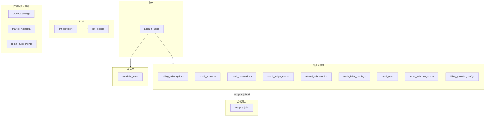

# TG-web 数据库字典

> 来源：`tg-web/src/backend/database/schema.ts`（Drizzle ORM）  
> 数据库：PostgreSQL  
> 迁移：由 tg-web 生成并执行（`pnpm db:migrate`）；tg-core 仅校验共享表是否存在，不执行 DDL。

## 1. 概述

本库共 19 张表，承载 TG-web 产品侧持久化，并与 tg-core 共享 `analysis_jobs` 分析任务表。身份认证由 Clerk 托管，本库只保存本地用户资料与业务数据。支付由 Stripe 托管，本库保存订阅镜像、积分账本与 webhook 幂等日志。

### 1.1 域划分

| 域 | 物理表 | 说明 |
| --- | --- | --- |
| 账户 | `account_users` | Clerk 同步资料与偏好 |
| 计费 / 积分 | `billing_subscriptions`, `credit_accounts`, `credit_billing_settings`, `credit_billing_setting_events`, `referral_relationships`, `credit_reservations`, `credit_ledger_entries`, `stripe_webhook_events`, `billing_provider_configs`, `billing_config_audit_events`, `credit_rules` | Stripe 订阅、积分钱包、预留结算、推荐奖励、计费配置 |
| 分析任务 | `analysis_jobs` | 与 tg-core 共享的 job 持久化 |
| LLM | `llm_providers`, `llm_models` | 提供商凭据、对用户开放的模型目录（含单价） |
| 自选股 | `watchlist_items` | 每用户收藏的标的 |
| 产品配置 / 审计 | `product_settings`, `market_metadata`, `admin_audit_events` | 功能开关、市场元数据、管理员审计 |

### 1.2 约定

| 约定 | 说明 |
| --- | --- |
| 主键命名 | 账户相关以 `clerk_user_id` 为用户主键；业务表多用 `uuid` |
| 时间戳 | 带时区（`timestamptz`），常见字段为 `created_at` / `updated_at` |
| 软删除 | 当前 schema 无通用 soft-delete |
| 密文 | Stripe / LLM API Key 以 ciphertext 字段存储，不以明文落库 |
| 金额 / 积分 | 美元多为 `numeric`；积分为 `bigint`（`mode: 'number'`） |
| 级联 | 指向 `account_users` / `llm_providers` 的外键多为 `ON DELETE CASCADE` |

---

## 2. UML / ER 总览

### 2.1 全局关系（UML 类图式 ER）

```mermaid
erDiagram
    account_users ||--o{ billing_subscriptions : has
    account_users ||--|| credit_accounts : owns
    account_users ||--o{ credit_reservations : reserves
    account_users ||--o{ credit_ledger_entries : ledger
    account_users ||--o{ referral_relationships : invitee
    account_users ||--o{ referral_relationships : inviter
    account_users ||--o{ watchlist_items : owns

    credit_reservations }o--o| analysis_jobs : settles

    llm_providers ||--o{ llm_models : catalogs
    account_users {
        text clerk_user_id PK
        text display_name
        text email
        text stripe_customer_id UK
        text referral_code UK
    }

    analysis_jobs {
        uuid id PK
        uuid request_id UK
        text ticker
        text status
        numeric cost_usd
    }

    credit_accounts {
        text clerk_user_id PK_FK
        bigint available_credits
        bigint reserved_credits
        bigint spent_credits
    }

    llm_providers {
        text id PK
        text driver
        boolean enabled
    }

    llm_models {
        uuid id PK
        text provider_id FK
        text model
        boolean enabled
    }
```

### 2.2 账户

```mermaid
erDiagram
    account_users {
        text clerk_user_id PK
        text display_name
        text email
        text avatar_url
        text interface_language
        text report_language
        text timezone
        text default_market
        text stripe_customer_id UK_null
        text referral_code UK
        timestamptz onboarding_completed_at
        timestamptz created_at
        timestamptz updated_at
    }
```

### 2.3 计费、积分与推荐

```mermaid
erDiagram
    account_users ||--o{ billing_subscriptions : subscriptions
    account_users ||--|| credit_accounts : wallet
    account_users ||--o{ credit_reservations : reservations
    account_users ||--o{ credit_ledger_entries : entries
    account_users ||--o{ referral_relationships : as_invitee
    account_users ||--o{ referral_relationships : as_inviter
    credit_reservations }o--o| analysis_jobs : "analysis_job_id (logical)"

    billing_subscriptions {
        text stripe_subscription_id PK
        text clerk_user_id FK
        text stripe_customer_id
        text stripe_price_id
        text status
        int cancel_at_period_end
        timestamptz current_period_end
    }

    credit_accounts {
        text clerk_user_id PK_FK
        bigint available_credits
        bigint reserved_credits
        bigint spent_credits
    }

    credit_reservations {
        uuid request_id PK
        text clerk_user_id FK
        uuid analysis_job_id UK_null
        bigint units
        text status
        timestamptz settled_at
    }

    credit_ledger_entries {
        uuid id PK
        text clerk_user_id FK
        text entry_type
        bigint available_delta
        text idempotency_key UK
        text reference_type
        text reference_id
    }

    referral_relationships {
        text invitee_clerk_user_id PK_FK
        text inviter_clerk_user_id FK
        text referral_code
        bigint signup_grant_points
        bigint referral_reward_points
    }

    credit_billing_settings {
        text id PK
        numeric points_per_usd
        int markup_basis_points
        numeric signup_grant_usd
        numeric referral_reward_usd
    }

    credit_rules {
        uuid id PK
        text market
        int min_analysts
        int max_analysts
        int units
        int priority
    }
```

### 2.4 分析任务

```mermaid
erDiagram
    analysis_jobs {
        uuid id PK
        uuid request_id UK_null
        text ticker
        date trade_date
        text status
        jsonb request
        jsonb config
        text decision
        numeric cost_usd
        int progress_percent
        timestamptz started_at
        timestamptz finished_at
    }
```

### 2.5 LLM 目录与单价

```mermaid
erDiagram
    llm_providers ||--o{ llm_models : "1:N cascade"

    llm_providers {
        text id PK
        text driver
        text display_name
        boolean enabled
        text backend_url
        text api_key_ciphertext
        int sort_order
    }

    llm_models {
        uuid id PK
        text provider_id FK
        text model UK_per_provider
        text display_name
        text role
        boolean enabled
        numeric input_price
        numeric output_price
        int context_window
        jsonb params
        jsonb capabilities
    }
```

### 2.6 自选股

```mermaid
erDiagram
    account_users ||--o{ watchlist_items : owns

    watchlist_items {
        uuid id PK
        text clerk_user_id FK
        text exchange
        text symbol
        text display_ticker
        text provider_symbol UK_per_user
        text display_name
        text logo_url
        int sort_order
    }
```

### 2.7 Stripe / 计费配置与产品配置（无用户 FK 或弱关联）

```mermaid
erDiagram
    stripe_webhook_events {
        text stripe_event_id PK
        text event_type
        text status
        jsonb payload
        timestamptz received_at
        timestamptz processed_at
    }

    billing_provider_configs {
        text provider PK
        text secret_key_ciphertext
        text webhook_secret_ciphertext
        text updated_by_clerk_user_id
    }

    billing_config_audit_events {
        uuid id PK
        text provider
        text action
        text actor_clerk_user_id
        timestamptz created_at
    }

    credit_billing_setting_events {
        uuid id PK
        jsonb previous_settings
        jsonb next_settings
        text actor_clerk_user_id
        timestamptz created_at
    }

    product_settings {
        text key PK
        jsonb value
        text updated_by
        timestamptz updated_at
    }

    market_metadata {
        text code PK
        int enabled
        text display_name
        text timezone
        text currency
        int sort_order
    }

    admin_audit_events {
        uuid id PK
        text actor_clerk_user_id
        text action
        text target_type
        text target_id
        jsonb metadata
        timestamptz created_at
    }
```



### 2.8 域级组件图（逻辑归属）



---

## 3. 表字典

说明列含义：

| 列 | 含义 |
| --- | --- |
| 字段 | 物理列名 |
| 类型 | PostgreSQL / Drizzle 映射类型 |
| 空 | 是否允许 NULL |
| 默认 | 默认值 |
| 说明 | 业务含义 |

索引与约束单独列在各表末尾。

---

### 3.1 `account_users`（导出名：`accountUsers`）

Clerk 用户对应的本地账户（偏好设置 + Stripe Customer 关联）。

| 字段 | 类型 | 空 | 默认 | 说明 |
| --- | --- | --- | --- | --- |
| `clerk_user_id` | `text` | N | — | **PK**。Clerk 用户 ID；账户/计费相关表共用的主键 |
| `display_name` | `text` | N | — | 从 Clerk 同步的显示名 |
| `email` | `text` | Y | — | Clerk 主邮箱；若无则为 null |
| `avatar_url` | `text` | N | `''` | Clerk 头像 URL；未设置时为空字符串 |
| `interface_language` | `text` | N | `'en'` | 界面语言：`en` \| `zh-CN` |
| `report_language` | `text` | N | `'English'` | 研究报告输出语言偏好 |
| `timezone` | `text` | N | `'UTC'` | 本地时间展示用的 IANA 时区 |
| `default_market` | `text` | N | `'US'` | 默认市场：`US` \| `HK` \| `CN` \| `CRYPTO` |
| `stripe_customer_id` | `text` | Y | — | 关联的 Stripe Customer ID（`cus_...`）；创建前为 null |
| `referral_code` | `text` | N | — | 用户专属推荐码 |
| `onboarding_completed_at` | `timestamptz` | Y | — | 完成 onboarding 的时间 |
| `created_at` | `timestamptz` | N | `now()` | 创建时间 |
| `updated_at` | `timestamptz` | N | `now()` | 更新时间 |

**索引 / 约束**

| 名称 | 类型 | 列 |
| --- | --- | --- |
| `account_users_pkey` | PRIMARY KEY | `clerk_user_id` |
| `account_users_stripe_customer_key` | UNIQUE（部分，`stripe_customer_id IS NOT NULL`） | `stripe_customer_id` |
| `account_users_referral_code_key` | UNIQUE | `referral_code` |

---

### 3.2 `billing_subscriptions`

Stripe 订阅的本地镜像，用于访问权限校验。

| 字段 | 类型 | 空 | 默认 | 说明 |
| --- | --- | --- | --- | --- |
| `stripe_subscription_id` | `text` | N | — | **PK**。Stripe Subscription ID（`sub_...`） |
| `clerk_user_id` | `text` | N | — | **FK → account_users**（CASCADE） |
| `stripe_customer_id` | `text` | N | — | 订阅上的 Stripe Customer ID |
| `stripe_price_id` | `text` | N | — | 当前计费的 Stripe Price ID（`price_...`） |
| `status` | `text` | N | — | Stripe 状态字符串（active、trialing、canceled 等） |
| `cancel_at_period_end` | `integer` | N | `0` | Stripe 开启 `cancel_at_period_end` 时为 1，否则为 0 |
| `current_period_start` | `timestamptz` | Y | — | 当前计费周期开始时间 |
| `current_period_end` | `timestamptz` | Y | — | 当前计费周期结束时间；用于判断订阅是否仍有效 |
| `latest_invoice_id` | `text` | Y | — | 该订阅最近一张 Stripe Invoice ID |
| `created_at` | `timestamptz` | N | `now()` | 创建时间 |
| `updated_at` | `timestamptz` | N | `now()` | 更新时间 |

**索引 / 约束**

| 名称 | 类型 | 列 |
| --- | --- | --- |
| `billing_subscriptions_pkey` | PRIMARY KEY | `stripe_subscription_id` |
| `billing_subscriptions_user_status_idx` | INDEX | `(clerk_user_id, status)` |

---

### 3.3 `credit_accounts`

每用户分析积分余额（可用 / 预留 / 已消费）。

| 字段 | 类型 | 空 | 默认 | 说明 |
| --- | --- | --- | --- | --- |
| `clerk_user_id` | `text` | N | — | **PK / FK → account_users**（CASCADE）。每用户一个积分钱包 |
| `available_credits` | `bigint` | N | `0` | 可预留给新分析的积分 |
| `reserved_credits` | `bigint` | N | `0` | 进行中分析预留占用的积分 |
| `spent_credits` | `bigint` | N | `0` | 已完成分析永久扣减的积分 |
| `updated_at` | `timestamptz` | N | `now()` | 更新时间 |

---

### 3.4 `credit_billing_settings`

产品级「积分 / 美元」定价配置（单行配置表，默认 `id = 'default'`）。

| 字段 | 类型 | 空 | 默认 | 说明 |
| --- | --- | --- | --- | --- |
| `id` | `text` | N | `'default'` | **PK** |
| `points_per_usd` | `numeric(18,6)` | N | `100` | 每美元对应积分数 |
| `markup_basis_points` | `integer` | N | `1000` | 加价率（基点，1000 = 10%） |
| `reserve_buffer_basis_points` | `integer` | N | `2000` | 预留缓冲（基点） |
| `default_estimated_cost_usd` | `numeric(18,8)` | N | `1.00000000` | 默认预估成本（美元） |
| `signup_grant_usd` | `numeric(18,2)` | N | `5.00` | 注册赠送对应的美元额度 |
| `referral_reward_usd` | `numeric(18,2)` | N | `2.00` | 推荐奖励对应的美元额度 |
| `updated_by_clerk_user_id` | `text` | Y | — | 最近修改人 |
| `created_at` | `timestamptz` | N | `now()` | 创建时间 |
| `updated_at` | `timestamptz` | N | `now()` | 更新时间 |

---

### 3.5 `credit_billing_setting_events`

积分计费设置变更的追加写审计快照。

| 字段 | 类型 | 空 | 默认 | 说明 |
| --- | --- | --- | --- | --- |
| `id` | `uuid` | N | `gen_random_uuid()` | **PK** |
| `previous_settings` | `jsonb` | Y | — | 变更前快照；首次可为 null |
| `next_settings` | `jsonb` | N | — | 变更后快照 |
| `actor_clerk_user_id` | `text` | N | — | 操作者 Clerk 用户 ID |
| `created_at` | `timestamptz` | N | `now()` | 事件时间 |

---

### 3.6 `referral_relationships`

邀请关系及发放时锁定的奖励快照。约束：邀请人 ≠ 被邀请人。

| 字段 | 类型 | 空 | 默认 | 说明 |
| --- | --- | --- | --- | --- |
| `invitee_clerk_user_id` | `text` | N | — | **PK / FK → account_users**（CASCADE）。被邀请人 |
| `inviter_clerk_user_id` | `text` | N | — | **FK → account_users**（CASCADE）。邀请人 |
| `referral_code` | `text` | N | — | 使用的推荐码 |
| `points_per_usd` | `numeric(18,6)` | N | — | 发放时锁定的积分汇率 |
| `signup_grant_usd` | `numeric(18,2)` | N | — | 注册赠送美元快照 |
| `signup_grant_points` | `bigint` | N | — | 注册赠送积分数 |
| `referral_reward_usd` | `numeric(18,2)` | N | — | 推荐奖励美元快照 |
| `referral_reward_points` | `bigint` | N | — | 推荐奖励积分数 |
| `created_at` | `timestamptz` | N | `now()` | 建立时间 |

**索引 / 约束**

| 名称 | 类型 | 列 / 表达式 |
| --- | --- | --- |
| `referral_relationships_pkey` | PRIMARY KEY | `invitee_clerk_user_id` |
| `referral_relationships_inviter_created_idx` | INDEX | `(inviter_clerk_user_id, created_at DESC)` |
| `referral_relationships_distinct_users_check` | CHECK | `invitee_clerk_user_id <> inviter_clerk_user_id` |

---

### 3.7 `credit_reservations`

单次分析请求的幂等积分预留。主键为客户端/API 的 `request_id`。

| 字段 | 类型 | 空 | 默认 | 说明 |
| --- | --- | --- | --- | --- |
| `request_id` | `uuid` | N | — | **PK**。分析请求 ID；同时用于账本幂等键 |
| `clerk_user_id` | `text` | N | — | **FK → account_users**（CASCADE） |
| `analysis_job_id` | `uuid` | Y | — | Core 接受任务后关联的 `analysis_jobs.id`（逻辑关联，schema 未声明 FK） |
| `units` | `bigint` | N | — | 预留积分数；CHECK `units > 0` |
| `estimated_cost_usd` | `numeric(18,8)` | Y | — | 预估美元成本 |
| `pricing_snapshot` | `jsonb` | Y | — | 定价快照（含 `billing_signature` 等） |
| `settled_units` | `bigint` | Y | — | 结算积分数 |
| `settled_cost_usd` | `numeric(18,8)` | Y | — | 结算美元成本 |
| `status` | `text` | N | — | `reserved` → `consumed` \| `released` |
| `reason` | `text` | Y | — | 释放/消费原因（可选，审计用） |
| `created_at` | `timestamptz` | N | `now()` | 创建时间 |
| `updated_at` | `timestamptz` | N | `now()` | 更新时间 |
| `settled_at` | `timestamptz` | Y | — | 预留离开 `reserved` 状态的时间 |

**索引 / 约束**

| 名称 | 类型 | 列 / 表达式 |
| --- | --- | --- |
| `credit_reservations_pkey` | PRIMARY KEY | `request_id` |
| `credit_reservations_units_check` | CHECK | `units > 0` |
| `credit_reservations_analysis_job_key` | UNIQUE（部分，`analysis_job_id IS NOT NULL`） | `analysis_job_id` |
| `credit_reservations_user_created_idx` | INDEX | `(clerk_user_id, created_at DESC)` |
| `credit_reservations_billing_signature_idx` | INDEX | `(pricing_snapshot->>'billing_signature')` |

---

### 3.8 `credit_ledger_entries`

追加写的积分变动流水（发放、预留、释放等）。

| 字段 | 类型 | 空 | 默认 | 说明 |
| --- | --- | --- | --- | --- |
| `id` | `uuid` | N | `gen_random_uuid()` | **PK** |
| `clerk_user_id` | `text` | N | — | **FK → account_users**（CASCADE） |
| `entry_type` | `text` | N | — | `grant` \| `reserve` \| `consume` \| `release` \| `adjustment` |
| `available_delta` | `bigint` | N | `0` | 对 `available_credits` 的有符号增量 |
| `reserved_delta` | `bigint` | N | `0` | 对 `reserved_credits` 的有符号增量 |
| `spent_delta` | `bigint` | N | `0` | 对 `spent_credits` 的有符号增量 |
| `idempotency_key` | `text` | N | — | 防止重复入账的唯一键 |
| `reference_type` | `text` | N | — | 外部引用类别（如 `analysis_request`、`stripe_invoice`） |
| `reference_id` | `text` | N | — | 与 `reference_type` 对应的外部引用 ID |
| `description` | `text` | N | — | 供 UI/审计阅读的说明 |
| `metadata` | `jsonb` | N | `{}` | 额外结构化上下文 |
| `created_at` | `timestamptz` | N | `now()` | 入账时间 |

**索引 / 约束**

| 名称 | 类型 | 列 |
| --- | --- | --- |
| `credit_ledger_entries_pkey` | PRIMARY KEY | `id` |
| `credit_ledger_idempotency_key` | UNIQUE | `idempotency_key` |
| `credit_ledger_user_created_idx` | INDEX | `(clerk_user_id, created_at DESC)` |

---

### 3.9 `stripe_webhook_events`

Stripe webhook 投递日志，用于幂等处理。

| 字段 | 类型 | 空 | 默认 | 说明 |
| --- | --- | --- | --- | --- |
| `stripe_event_id` | `text` | N | — | **PK**。Stripe Event ID（`evt_...`） |
| `event_type` | `text` | N | — | Stripe 事件类型（如 `invoice.paid`） |
| `status` | `text` | N | — | `processing` \| `processed` \| `failed` \| `ignored` |
| `payload` | `jsonb` | N | — | 规范化后的事件载荷，用于审计/重放 |
| `error` | `text` | Y | — | `failed` 时的最近错误信息 |
| `received_at` | `timestamptz` | N | `now()` | 首次接受 webhook 的时间 |
| `processed_at` | `timestamptz` | Y | — | 处理完成（processed/ignored）的时间 |
| `updated_at` | `timestamptz` | N | `now()` | 更新时间 |

---

### 3.10 `billing_provider_configs`

管理员维护的计费提供商凭据（当前为 Stripe，密文存储）。

| 字段 | 类型 | 空 | 默认 | 说明 |
| --- | --- | --- | --- | --- |
| `provider` | `text` | N | — | **PK**。提供商键；目前仅 `stripe` |
| `secret_key_ciphertext` | `text` | N | — | 加密后的 Stripe secret key 密文 |
| `webhook_secret_ciphertext` | `text` | N | — | 加密后的 Stripe webhook 签名密钥密文 |
| `updated_by_clerk_user_id` | `text` | N | — | 最近写入该配置的管理员 Clerk 用户 ID |
| `created_at` | `timestamptz` | N | `now()` | 创建时间 |
| `updated_at` | `timestamptz` | N | `now()` | 更新时间 |

---

### 3.11 `billing_config_audit_events`

计费提供商配置变更的审计流水。

| 字段 | 类型 | 空 | 默认 | 说明 |
| --- | --- | --- | --- | --- |
| `id` | `uuid` | N | `gen_random_uuid()` | **PK** |
| `provider` | `text` | N | — | 被变更的提供商（当前 `stripe`） |
| `action` | `text` | N | — | `configured` \| `cleared` |
| `actor_clerk_user_id` | `text` | N | — | 执行操作的 Clerk 管理员 |
| `created_at` | `timestamptz` | N | `now()` | 事件时间 |

**索引 / 约束**

| 名称 | 类型 | 列 |
| --- | --- | --- |
| `billing_config_audit_events_pkey` | PRIMARY KEY | `id` |
| `billing_config_audit_provider_created_idx` | INDEX | `(provider, created_at DESC)` |

---

### 3.12 `analysis_jobs`

与 tg-core 共享的分析任务持久化。保存请求快照、进度、最终结果与成本核算。

| 字段 | 类型 | 空 | 默认 | 说明 |
| --- | --- | --- | --- | --- |
| `id` | `uuid` | N | — | **PK**。创建分析时分配的任务 ID |
| `request_id` | `uuid` | Y | — | 客户端请求 ID，用于幂等创建；可选 |
| `ticker` | `text` | N | — | 列表展示用的规范化 ticker / 代码 |
| `exchange` | `text` | Y | — | 经标的解析得到的交易所代码 |
| `trade_date` | `date` | N | — | 分析对应的交易日（YYYY-MM-DD） |
| `asset_type` | `text` | N | — | 标的解析得到的资产类型 |
| `analysts` | `jsonb` | N | — | 本次运行选中的分析师角色（`string[]`） |
| `status` | `text` | N | — | `queued` \| `running` \| `succeeded` \| `failed` |
| `request` | `jsonb` | N | — | 原始 API/CLI 请求载荷 |
| `config` | `jsonb` | N | `{}` | 合并覆盖项后的有效运行配置快照 |
| `display` | `jsonb` | N | `{}` | 任务的 UI/展示元数据 |
| `final_state` | `jsonb` | Y | — | 结束后的最终 LangGraph 状态；未完成时为 null |
| `decision` | `text` | Y | — | 图产出的结构化决策文本/摘要 |
| `error` | `text` | Y | — | `failed` 时的失败信息 |
| `report_path` | `text` | Y | — | 生成报告的文件系统或存储路径 |
| `tokens_used` | `integer` | N | `0` | 本轮运行的聚合 token 数 |
| `token_usage` | `jsonb` | N | `{}` | 按模型/步骤拆分的 token 用量 |
| `cost_usd` | `numeric(18,8)` | N | `0` | 本轮运行估算的美元成本 |
| `cost_breakdown` | `jsonb` | N | `{}` | 按提供商/模型/步骤拆分的成本 |
| `progress_percent` | `integer` | N | `0` | 进度百分比 0–100 |
| `current_step` | `text` | Y | — | 当前图步骤标签 |
| `events` | `jsonb` | N | `[]` | 有序进度/事件日志 |
| `created_at` | `timestamptz` | N | `now()` | 创建时间 |
| `updated_at` | `timestamptz` | N | `now()` | 更新时间 |
| `started_at` | `timestamptz` | Y | — | Worker 开始执行任务的时间 |
| `finished_at` | `timestamptz` | Y | — | 任务到达终态的时间 |

**索引 / 约束**

| 名称 | 类型 | 列 / 表达式 |
| --- | --- | --- |
| `analysis_jobs_pkey` | PRIMARY KEY | `id` |
| `analysis_jobs_status_check` | CHECK | `status IN ('queued','running','succeeded','failed')` |
| `analysis_jobs_request_id_key` | UNIQUE（部分，`request_id IS NOT NULL`） | `request_id` |
| `analysis_jobs_ticker_created_idx` | INDEX | `(ticker, created_at DESC)` |
| `analysis_jobs_status_created_idx` | INDEX | `(status, created_at DESC)` |

---

### 3.13 `llm_providers`

管理员配置的 LLM 提供商实例（含加密 API Key）。

| 字段 | 类型 | 空 | 默认 | 说明 |
| --- | --- | --- | --- | --- |
| `id` | `text` | N | — | **PK**。目录实例唯一键（可与 driver 不同） |
| `driver` | `text` | N | — | Core LLM 工厂类型（白名单）；同 driver 可有多条实例 |
| `display_name` | `text` | N | — | 展示名 |
| `enabled` | `boolean` | N | `true` | 是否启用 |
| `backend_url` | `text` | Y | — | 自定义兼容端点 URL |
| `api_key_ciphertext` | `text` | Y | — | 加密 API Key 密文 |
| `api_key_hint` | `text` | Y | — | Key 掩码提示（如末四位） |
| `sort_order` | `integer` | N | `0` | 排序 |
| `notes` | `text` | Y | — | 备注 |
| `created_at` | `timestamptz` | N | `now()` | 创建时间 |
| `updated_at` | `timestamptz` | N | `now()` | 更新时间 |

**索引 / 约束**

| 名称 | 类型 | 列 |
| --- | --- | --- |
| `llm_providers_pkey` | PRIMARY KEY | `id` |
| `llm_providers_driver_idx` | INDEX | `driver` |

---

### 3.14 `llm_models`

管理员纳管的 LLM 模型目录；`enabled` 表示对用户开放。

| 字段 | 类型 | 空 | 默认 | 说明 |
| --- | --- | --- | --- | --- |
| `id` | `uuid` | N | `gen_random_uuid()` | **PK** |
| `provider_id` | `text` | N | — | **FK → llm_providers.id**（CASCADE） |
| `model` | `text` | N | — | 模型 ID |
| `display_name` | `text` | N | — | 展示名 |
| `role` | `text` | N | `'both'` | 角色用途（如 deep / quick / both） |
| `enabled` | `boolean` | N | `false` | 是否对用户开放 |
| `currency` | `text` | N | `'USD'` | 货币 |
| `unit_tokens` | `integer` | N | `1000000` | 单价 token 基数 |
| `input_price` | `numeric(18,8)` | Y | — | 输入单价 |
| `output_price` | `numeric(18,8)` | Y | — | 输出单价 |
| `cached_input_price` | `numeric(18,8)` | Y | — | 缓存输入单价 |
| `cache_write_price` | `numeric(18,8)` | Y | — | cache-write 单价 |
| `context_window` | `integer` | Y | — | 上下文窗口 |
| `max_output_tokens` | `integer` | Y | — | 最大输出 token |
| `params` | `jsonb` | N | `{}` | 默认调用参数 |
| `capabilities` | `jsonb` | N | `{}` | 能力标记 |
| `synced_at` | `timestamptz` | Y | — | 最近同步时间 |
| `sync_error` | `text` | Y | — | 同步错误信息 |
| `created_at` | `timestamptz` | N | `now()` | 创建时间 |
| `updated_at` | `timestamptz` | N | `now()` | 更新时间 |

**索引 / 约束**

| 名称 | 类型 | 列 |
| --- | --- | --- |
| `llm_models_pkey` | PRIMARY KEY | `id` |
| `llm_models_provider_model_uidx` | UNIQUE | `(provider_id, model)` |
| `llm_models_enabled_idx` | INDEX | `enabled` |

---

### 3.15 `watchlist_items`

用户自选股收藏条目（按 listing 字段去规范化，无分组与标签）。

| 字段 | 类型 | 空 | 默认 | 说明 |
| --- | --- | --- | --- | --- |
| `id` | `uuid` | N | `gen_random_uuid()` | **PK** |
| `clerk_user_id` | `text` | N | — | **FK → account_users**（CASCADE） |
| `exchange` | `text` | N | — | 交易所 |
| `symbol` | `text` | N | — | 代码 |
| `display_ticker` | `text` | N | — | 展示用 ticker |
| `provider_symbol` | `text` | N | — | 数据源侧 symbol（用户内唯一） |
| `display_name` | `text` | N | — | 标的显示名 |
| `logo_url` | `text` | Y | — | Logo URL |
| `sort_order` | `integer` | N | `0` | 排序 |
| `created_at` | `timestamptz` | N | `now()` | 创建时间 |
| `updated_at` | `timestamptz` | N | `now()` | 更新时间 |

**索引 / 约束**

| 名称 | 类型 | 列 |
| --- | --- | --- |
| `watchlist_items_pkey` | PRIMARY KEY | `id` |
| `watchlist_items_user_provider_key` | UNIQUE | `(clerk_user_id, provider_symbol)` |
| `watchlist_items_user_sort_idx` | INDEX | `(clerk_user_id, sort_order)` |

---

### 3.16 `product_settings`

产品级 JSON 设置（维护公告、功能开关、免责声明覆盖、告警 webhook）。

| 字段 | 类型 | 空 | 默认 | 说明 |
| --- | --- | --- | --- | --- |
| `key` | `text` | N | — | **PK**。设置键 |
| `value` | `jsonb` | N | — | JSON 配置值 |
| `updated_by` | `text` | Y | — | 最近更新人 |
| `updated_at` | `timestamptz` | N | `now()` | 更新时间 |

---

### 3.17 `market_metadata`

可管理的市场元数据。

| 字段 | 类型 | 空 | 默认 | 说明 |
| --- | --- | --- | --- | --- |
| `code` | `text` | N | — | **PK**。市场代码（如 US / HK / CN） |
| `enabled` | `integer` | N | `1` | 是否启用（1/0） |
| `display_name` | `text` | N | — | 展示名 |
| `timezone` | `text` | N | — | 市场时区 |
| `currency` | `text` | N | — | 计价货币 |
| `session_notes` | `text` | Y | — | 交易时段说明 |
| `disclaimer` | `text` | Y | — | 市场免责声明 |
| `sort_order` | `integer` | N | `0` | 排序 |
| `updated_at` | `timestamptz` | N | `now()` | 更新时间 |

---

### 3.18 `credit_rules`

按市场 / 分析师数量解析分析额度消耗。

| 字段 | 类型 | 空 | 默认 | 说明 |
| --- | --- | --- | --- | --- |
| `id` | `uuid` | N | `gen_random_uuid()` | **PK** |
| `label` | `text` | N | — | 规则标签 |
| `market` | `text` | Y | — | 匹配市场；`null` 表示任意市场 |
| `min_analysts` | `integer` | N | `1` | 最小分析师数量（含） |
| `max_analysts` | `integer` | N | `99` | 最大分析师数量（含） |
| `units` | `integer` | N | — | 消耗积分数 |
| `enabled` | `integer` | N | `1` | 是否启用 |
| `priority` | `integer` | N | `0` | 优先级（越大越优先，具体实现以业务代码为准） |
| `created_at` | `timestamptz` | N | `now()` | 创建时间 |
| `updated_at` | `timestamptz` | N | `now()` | 更新时间 |

**索引 / 约束**

| 名称 | 类型 | 列 |
| --- | --- | --- |
| `credit_rules_pkey` | PRIMARY KEY | `id` |
| `credit_rules_priority_idx` | INDEX | `priority` |

---

### 3.19 `admin_audit_events`

管理员与关键产品操作的通用审计日志。

| 字段 | 类型 | 空 | 默认 | 说明 |
| --- | --- | --- | --- | --- |
| `id` | `uuid` | N | `gen_random_uuid()` | **PK** |
| `actor_clerk_user_id` | `text` | N | — | 操作者 Clerk 用户 ID |
| `action` | `text` | N | — | 动作标识 |
| `target_type` | `text` | Y | — | 目标类型 |
| `target_id` | `text` | Y | — | 目标 ID |
| `metadata` | `jsonb` | N | `{}` | 额外上下文 |
| `created_at` | `timestamptz` | N | `now()` | 事件时间 |

**索引 / 约束**

| 名称 | 类型 | 列 |
| --- | --- | --- |
| `admin_audit_events_pkey` | PRIMARY KEY | `id` |
| `admin_audit_events_created_idx` | INDEX | `created_at` |
| `admin_audit_events_action_idx` | INDEX | `action` |
| `admin_audit_events_actor_idx` | INDEX | `actor_clerk_user_id` |

---

## 4. 外键关系一览

| 子表 | 列 | 父表 | 父列 | ON DELETE |
| --- | --- | --- | --- | --- |
| `billing_subscriptions` | `clerk_user_id` | `account_users` | `clerk_user_id` | CASCADE |
| `credit_accounts` | `clerk_user_id` | `account_users` | `clerk_user_id` | CASCADE |
| `referral_relationships` | `invitee_clerk_user_id` | `account_users` | `clerk_user_id` | CASCADE |
| `referral_relationships` | `inviter_clerk_user_id` | `account_users` | `clerk_user_id` | CASCADE |
| `credit_reservations` | `clerk_user_id` | `account_users` | `clerk_user_id` | CASCADE |
| `credit_ledger_entries` | `clerk_user_id` | `account_users` | `clerk_user_id` | CASCADE |
| `llm_models` | `provider_id` | `llm_providers` | `id` | CASCADE |
| `watchlist_items` | `clerk_user_id` | `account_users` | `clerk_user_id` | CASCADE |

**逻辑关联（schema 未声明 FK）**

| 子表 | 列 | 逻辑父表 | 说明 |
| --- | --- | --- | --- |
| `credit_reservations` | `analysis_job_id` | `analysis_jobs.id` | 预留结算关联；有部分唯一索引 |

---

## 5. 枚举 / 受限取值汇总

| 表.字段 | 取值 |
| --- | --- |
| `account_users.interface_language` | `en` \| `zh-CN`（约定） |
| `account_users.default_market` | `US` \| `HK` \| `CN` \| `CRYPTO`（约定） |
| `credit_reservations.status` | `reserved` \| `consumed` \| `released` |
| `credit_ledger_entries.entry_type` | `grant` \| `reserve` \| `consume` \| `release` \| `adjustment` |
| `stripe_webhook_events.status` | `processing` \| `processed` \| `failed` \| `ignored` |
| `billing_provider_configs.provider` | `stripe` |
| `billing_config_audit_events.action` | `configured` \| `cleared` |
| `analysis_jobs.status` | `queued` \| `running` \| `succeeded` \| `failed`（CHECK） |

---

## 6. 维护说明

- **单一事实来源**：表结构以 `tg-web/src/backend/database/schema.ts` 为准；本字典为可读文档，变更 schema 后应同步更新本文。
- **迁移**：在 `tg-web` 内执行 `pnpm db:migrate`；勿依赖 tg-core 自动建表。
- **共享表**：`analysis_jobs` 由 tg-web 与 tg-core 共同读写；变更状态机或字段时需同步两边契约与测试。
- **密文字段**：`*_ciphertext` 仅存密文；密钥材料不进入本字典与版本库。
