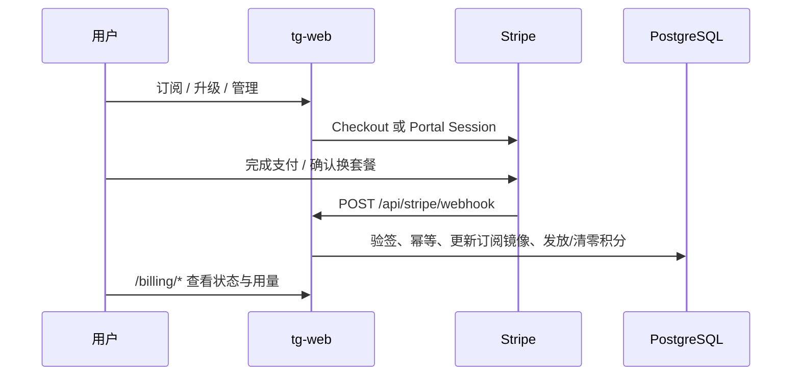

# Stripe 接入与环境配置手册

本文说明 TG-web 如何接入 Stripe（订阅 Checkout、Customer Portal、Webhook、积分发放），以及 **Test / Live（生产）** 两套环境的完整配置清单。

相关实现：`src/backend/billing/`、`src/backend/routes/billing.ts`；产品说明见 [PRODUCT_FUNCTIONS.md](./PRODUCT_FUNCTIONS.md)。

---

## 1. 架构边界

| 权威来源 | 内容 |
|----------|------|
| **Stripe** | 支付、订阅状态、发票、Customer、Price |
| **本系统 PostgreSQL** | 积分账本（`credit_accounts` / `credit_ledger_entries`）、订阅镜像（`billing_subscriptions`）、Webhook 幂等（`stripe_webhook_events`） |

- 应用**不保存**银行卡号；密钥只走部署环境变量，不落库、不进管理端明文。
- tg-core **不调用** Stripe；分析扣分只读共享积分账本。



---

## 2. 环境变量

配置位置：

- 本地：`tg-web/.env`（模板见 `tg-web/.env.example`）
- Docker / 部署：`docker/config.env` 或平台 Secret（**不要把 Live 密钥提交进 Git**）

| 变量 | 必填 | 说明 |
|------|------|------|
| `STRIPE_SECRET_KEY` | 计费开启时必填 | `sk_test_...`（测试）或 `sk_live_...`（生产）。未配置时应用仍可运行，计费页显示「未配置」。 |
| `STRIPE_WEBHOOK_SECRET` | 计费开启时必填 | `whsec_...`，用于校验 Webhook 签名。**本地 CLI 与 Dashboard Endpoint 的 whsec 不同，勿混用。** |
| `APP_BASE_URL` | 强烈建议 | 对外公开 Origin。用于 Checkout success/cancel、Portal `return_url`、管理端展示的 webhook URL。本地例：`http://localhost:5173`；生产例：`https://your-domain.com`。不设则回退 `CLERK_AUTHORIZED_PARTIES` 第一项。 |

说明：

- Test 与 Live 使用**不同 Stripe 账号模式**下的两套 Key / Webhook Secret / Product Price ID。
- 切环境时必须三件套一起换：`STRIPE_SECRET_KEY`、`STRIPE_WEBHOOK_SECRET`、`APP_BASE_URL`，并重新同步套餐与 Portal 配置。
- 密钥一旦出现在聊天、截图或仓库中，应在 Dashboard **轮换**后更新部署。

---

## 3. 产品内路由与 API

### 用户端

| 路径 | 作用 |
|------|------|
| `/billing/subscription` | 套餐列表、当前订阅、Checkout 新订、Portal 管理、升级/降级深链 |
| `/billing/usage` | 积分余额与账本 |
| `/billing/invoices` | Stripe 发票列表 |
| `/billing` | 重定向到 subscription |

### 管理端

| 路径 | 作用 |
|------|------|
| `/admin/billing` | Stripe 连接状态、Webhook URL 提示、套餐、事件 |
| `/admin/billing` →「同步默认套餐」 | 幂等创建三档 USD 月付 Product/Price |
| `/admin/billing/analysis` | 分析扣分汇率与门槛（与 Stripe 密钥无关） |

### HTTP API（BFF）

| 方法 | 路径 | 说明 |
|------|------|------|
| `GET` | `/api/billing/overview` | 套餐、当前订阅、发票、用量 |
| `POST` | `/api/billing/checkout` | `{ priceId, requestId, locale }` → Checkout URL |
| `POST` | `/api/billing/portal` | `{ locale, priceId? }` → Portal URL；带 `priceId` 时深链到换套餐确认页 |
| `POST` | `/api/stripe/webhook` | Stripe 签名回调（无用户登录） |
| `POST` | `/api/admin/billing/plans/defaults` | 管理员同步默认套餐 |

Webhook 完整 URL：

```text
{APP_BASE_URL}/api/stripe/webhook
```

本地示例：`http://localhost:5173/api/stripe/webhook`  
生产示例：`https://your-domain.com/api/stripe/webhook`

---

## 4. 默认套餐目录

管理员执行「同步默认套餐」后，Stripe 中应有三档（metadata 由应用写入）：

| 名称 | 月费 (USD) | 每周期套餐积分 | catalog_key |
|------|------------|----------------|-------------|
| Starter 20 | $20 | 2,000 | `starter-usd-monthly-2000-v2` |
| Growth 50 | $50 | 5,000 | `growth-usd-monthly-5000-v2` |
| Scale 100 | $100 | 10,000 | `scale-usd-monthly-10000-v2` |

Price / Product metadata 关键字段：

- `managed_by=tradingagents-web`
- `catalog_key=...`
- `analysis_credits=<整数>`

重复同步不会创建重复 Price；冲突会报错。**Test 与 Live 需分别执行一次同步。**

---

## 5. Stripe Dashboard 配置清单

以下在 **Test mode** 与 **Live mode** 各做一遍（右上角模式开关）。

### 5.1 API 密钥

1. [Developers → API keys](https://dashboard.stripe.com/test/apikeys)
2. 复制 Secret key → `STRIPE_SECRET_KEY`
3. 生产使用 Live 密钥；勿把 Live 密钥写进本地 `.env` 后提交

### 5.2 Webhook Endpoint（部署环境 / 公网）

1. [Developers → Webhooks](https://dashboard.stripe.com/test/webhooks) → Add endpoint  
2. URL：`https://<生产或测试公网域名>/api/stripe/webhook`  
3. 至少订阅下列事件（未列出的事件会被接受后 `ignored`，但建议收窄以降低噪音）：

| 事件 | 本系统用途 |
|------|------------|
| `invoice.paid` | 首订发放、续费清零后重发、升级补差（有 proration 发票时） |
| `customer.subscription.updated` | 订阅镜像；`cancel_at` / 期末取消；**换价时升级补差**（无立即发票时） |
| `customer.subscription.deleted` | 清零套餐积分 |
| `charge.refunded` / `charge.refund.updated` | 按比例回收未用套餐积分 |
| `charge.dispute.funds_withdrawn` / `charge.dispute.closed` | 败诉争议回收 |

也可在开发阶段先选「发送全部事件」，上线后再收窄。

4. 创建后复制 **Signing secret**（`whsec_...`）→ `STRIPE_WEBHOOK_SECRET`  
5. 重启 tg-web / 重新部署使环境变量生效

### 5.3 Customer Portal（必做）

路径：[Settings → Billing → Customer portal](https://dashboard.stripe.com/test/settings/billing/portal)

| 配置项 | 建议 |
|--------|------|
| 客户可更新付款方式 | 开启 |
| 客户可查看发票历史 | 开启 |
| **Customers can switch plans / 允许切换套餐** | **开启**，并勾选 Starter / Growth / Scale 对应 Product |
| 换方案时计费 | **按比例分配收款和信用额度**（金额抵扣，不是产品积分） |
| 收款时间 | **发票按比例分摊（更新时立即执行）** |
| 降级 | **立即更新**（与产品「本周期积分不扣、下周期按新套餐发」一致；金额侧按 Stripe 规则） |
| 取消 | 允许取消；本产品按**期末取消**展示（`cancel_at` / 周期结束） |

说明：Portal 里的「信用额度」是账单金额，与应用内「分析积分」无关。

### 5.4 品牌与回跳

- Checkout / Portal 展示名、Logo：Brand settings  
- 成功回跳由代码写死为 `{APP_BASE_URL}/billing?checkout=success` 等，**务必让 `APP_BASE_URL` 等于用户浏览器可访问的 Origin**

---

## 6. 应用侧初始化步骤

对每个环境（本地 Test、预发 Test、生产 Live）执行：

1. 写入 `STRIPE_SECRET_KEY`、`STRIPE_WEBHOOK_SECRET`、`APP_BASE_URL`
2. 启动 tg-web，管理员登录  
3. 打开 `/admin/billing`，确认：
   - configured / connectionHealthy
   - mode = `test` 或 `live`
   - webhookConfigured = true
   - webhookUrl 与公网一致  
4. 点击 **同步默认套餐**（或调用 `POST /api/admin/billing/plans/defaults`）  
5. 在 Stripe Dashboard → Products 确认三档 Price 的 `analysis_credits` metadata  
6. 用测试卡走通：新订 → 用量到账 → 升级 → 取消（见 §8）

---

## 7. 本地开发 Webhook（Stripe CLI）

公网 Dashboard Endpoint **打不到** `localhost`，本地必须用 CLI 转发。

```bash
brew install stripe/stripe-cli/stripe
stripe login
# 必须登录与 STRIPE_SECRET_KEY 同一账号（Test 下 account id 一致）
stripe listen --forward-to localhost:5173/api/stripe/webhook
```

1. CLI 打印的 `whsec_...` 写入 `tg-web/.env` 的 `STRIPE_WEBHOOK_SECRET`（**覆盖** Dashboard 那份，仅本地有效）  
2. **重启** `./start.sh` 或 tg-web 进程  
3. 保持 `stripe listen` 运行；终端应出现 `--> <event> [200]`  

账号不一致时：CLI 账号 ≠ 应用 `sk_test_` 账号 → **永远收不到回调**。用：

```bash
stripe logout && stripe login
```

选对账号后再 `listen`。

测试卡（Test mode）：

| 场景 | 卡号 |
|------|------|
| 成功 | `4242 4242 4242 4242` |
| 拒付 | `4000 0000 0000 0002` |

任意未来有效期 + 任意 CVC。

---

## 8. 用户流程与积分规则

### 8.1 新订

1. `/billing/subscription` 选套餐 → Checkout  
2. 支付成功 → `invoice.paid`（`subscription_create`）→ 发放整档套餐积分  
3. 回跳 `/billing?checkout=success`

已有进行中订阅时，Checkout 会被拒绝（409），须走 Portal。

### 8.2 升级 / 降级（站内引导 + Portal）

订阅页按价格比较当前套餐：

- 更高价 → **升级** → Portal `flow_data=subscription_update_confirm`（深链到确认页）  
- 更低价 → **降级** → 同上  
- 当前档 → 禁用「当前套餐」  
- **管理订阅** → Portal 首页（取消、换卡、恢复续订等）

积分规则：

| 操作 | 积分行为 |
|------|----------|
| **升级** | 立即补发差额：`新套餐积分 − period_baseline`。触发：`invoice.paid`（`subscription_update`）**或** `customer.subscription.updated`（items 变更且无立即发票时） |
| **降级** | 本周期套餐积分不清零；**下个续费周期**按新套餐全额发放（续费前先清未用套餐积分） |
| **活动奖励** | 升降级均不动 |

金额侧：由 Portal「按比例」配置决定是否立即出 proration 发票。

### 8.3 取消

- 通常为**期末取消**：状态仍可显示为 active，页面展示「已取消」+ 到期日（识别 `cancel_at` / `cancel_at_period_end`）  
- 到期真正结束 / `deleted` / `canceled` / `unpaid` → 清零**套餐**积分；奖励保留  

### 8.4 续费

`invoice.paid` + `subscription_cycle`：先清未用套餐积分，再发放本周期全额套餐积分。

---

## 9. Test 环境接入检查表

- [ ] Stripe Dashboard 处于 **Test mode**
- [ ] `STRIPE_SECRET_KEY=sk_test_...`
- [ ] `APP_BASE_URL` = 本地或测试站 Origin（含协议，无尾斜杠问题）
- [ ] 本地：`stripe listen` 账号与 Key 一致；`STRIPE_WEBHOOK_SECRET` = CLI 打印的 `whsec_`
- [ ] 预发公网：Dashboard Webhook URL 指向预发 `/api/stripe/webhook`；`whsec` 来自该 Endpoint
- [ ] Customer Portal：允许切换套餐 + 按比例立即出账（建议）
- [ ] `/admin/billing` 同步默认套餐成功
- [ ] 测试：Starter 新订 → Usage 到账 → 升到 Growth → 套餐积分补差 → 期末取消文案正确

---

## 10. 生产（Live）环境接入检查表

- [ ] Stripe Dashboard 切换到 **Live mode**（与 Test **完全独立**）
- [ ] `STRIPE_SECRET_KEY=sk_live_...`（仅 Secret / 平台环境变量）
- [ ] `APP_BASE_URL=https://正式域名`
- [ ] 新建 Live Webhook Endpoint → 正式 `https://域名/api/stripe/webhook`
- [ ] `STRIPE_WEBHOOK_SECRET` = **该 Live Endpoint** 的 Signing secret（不是 Test、不是 CLI）
- [ ] Live 下再配一遍 Customer Portal（套餐切换、按比例、取消）
- [ ] Live 下管理员再执行一次「同步默认套餐」
- [ ] 用真实小额卡或 Stripe 生产验证流程做冒烟（按公司合规要求）
- [ ] 确认未把 Live 密钥写入仓库、文档或聊天记录
- [ ] 监控 `/admin/billing` 事件：失败状态、订阅与积分是否一致

生产切流建议：先只配 Webhook 与套餐，内部账号试订，再对用户开放订阅入口。

---

## 11. 常见问题

| 现象 | 排查 |
|------|------|
| 支付成功但无回调 | CLI/Endpoint 账号是否与 `sk_` 一致；`stripe listen` 是否在跑；公网 URL 是否可达 |
| 回调 400 签名错误 | `STRIPE_WEBHOOK_SECRET` 是否对应当前转发源（CLI ≠ Dashboard Endpoint） |
| 改了 `.env` 仍用旧 secret | 未重启 tg-web |
| 升级后套餐变了但积分不变 | 旧逻辑只认 `invoice.paid`；当前版本也会在换价的 `subscription.updated` 上补差。查 `stripe_webhook_events` 与 `credit_ledger_entries` |
| Portal 无「换套餐」 | Dashboard 未开启 switch plans / 未勾选 Product |
| 站内只有「管理订阅」能改 | 正常；升降级按钮依赖 Portal 深链与「允许切换套餐」 |
| Checkout 报已有订阅 | 周期未结束；用 Portal 改套餐或等取消生效后再新订 |
| 计费页「未配置」 | 缺少 `STRIPE_SECRET_KEY` |

对账查询示例（PostgreSQL）：

```sql
SELECT event_type, status, error, updated_at
FROM stripe_webhook_events
ORDER BY updated_at DESC
LIMIT 20;

SELECT stripe_subscription_id, status, stripe_price_id, cancel_at_period_end, updated_at
FROM billing_subscriptions
ORDER BY updated_at DESC
LIMIT 10;

SELECT available_credits, period_credits, bonus_credits, period_baseline_credits, period_end
FROM credit_accounts
WHERE clerk_user_id = '<clerk_user_id>';
```

---

## 12. 安全注意

- 仅服务端使用 Secret Key；前端只用 Clerk，不嵌入 Stripe Secret。  
- Webhook 必须验签（`constructEvent`）；不要在无签名时处理业务。  
- Test / Live 密钥与 Product 隔离；预发建议始终用 Test。  
- 轮换密钥后同步更新所有部署副本的环境变量并重启。  

---

## 13. 文档与代码索引

| 资源 | 路径 |
|------|------|
| 环境变量模板 | `tg-web/.env.example` |
| Stripe 服务 | `tg-web/src/backend/billing/stripe-billing.ts` |
| 积分发放 / Webhook 落库 | `tg-web/src/backend/database/billing-repository.ts` |
| 路由 | `tg-web/src/backend/routes/billing.ts` |
| 订阅页 | `tg-web/src/frontend/pages/subscription-page.tsx` |
| 产品功能 | `tg-web/docs/PRODUCT_FUNCTIONS.md` |
| 表结构 | `tg-web/docs/DATABASE_DICTIONARY.md` |
